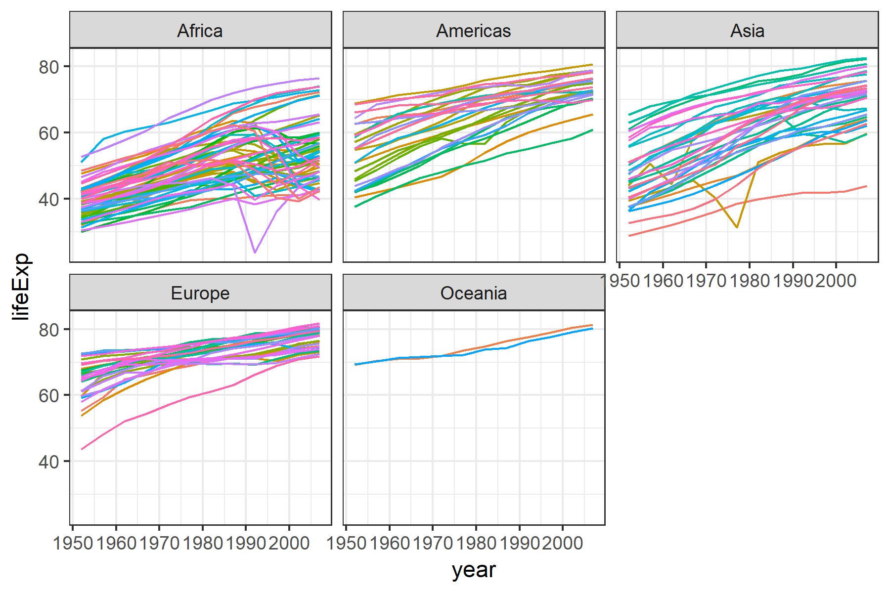

# Homework 05: Factor and figure management

```{r}
library(tidyverse)
library(gapminder)
library(knitr)
library(scales)
library(plotly)
```

## Part 1: Factor management

### Elaboration for the gapminder data set

Drop Oceania. Filter the Gapminder data to remove observations associated with the continent of Oceania. Additionally, remove unused factor levels. Provide concrete information on the data before and after removing these rows and Oceania; address the number of rows and the levels of the affected factors.

```{r}
str(gapminder)
```

We can see 132 levels in country and 5 levels in continent. There are 1704 rows in total.

```{r}
gap_filter <- gapminder%>%
  filter(continent != "Oceania")

str(gap_filter)

levels(gap_filter$continent)
```

We can still see 142 levels in country and 5 levels in continent. So empty unused levels like "oceania" persist. However, there are 1680 rows in total.

```{r}
gap_filter %>%
  droplevels() %>%
  str()

gap_filter$continent %>%
  droplevels() %>%
  levels()
```

After `droplevels`, we can see that the number of rows is still 1680. However, the unused factors are removed. There are only 140 levels in country and 4 levels in continent. Indeed "Oceania", which is unused, is removed.

Reorder the levels of country or continent. Use the forcats package to change the order of the factor levels, based on a principled summary of one of the quantitative variables. Consider experimenting with a summary statistic beyond the most basic choice of the median.

I'll look at Europe in 1952.

```{r}
gap_europe1952 <- gapminder %>%
  filter(year == 1952, continent == "Europe")

#Head the filtered file
gap_europe1952 %>%
  head(15) %>%
  kable()
```

Note the alphabetical order.

```{r}
gap_europe1952 %>%
  ggplot(aes(country, gdpPercap, fill = country)) +
  geom_bar(stat = "identity", show.legend = FALSE) + #bar plot
  coord_flip() + #flip X and y
  theme_bw() #bw theme
```

We can see that the countries are ordered by alphabetical order still.

Let's try `arrange`.

```{r}
gap_europe1952 %>%
  arrange(gdpPercap) %>%
  head(15) %>%
  kable()
```

We can see that the table is arranged by gdpPerCap now.

```{r}
gap_europe1952 %>%
  arrange(gdpPercap) %>%
  ggplot(aes(country, gdpPercap, fill = country)) +
  geom_bar(stat = "identity", show.legend = FALSE) + #bar plot
  coord_flip() + #flip X and y
  theme_bw() #bw theme
```

But arrange has no effect on plotting order. This is still alphabetical on ggplot.

Let's try `fct_reorder`.

```{r}
gap_europe1952 %>%
  mutate(country = fct_reorder(country, gdpPercap)) %>%
  head(15) %>%
  kable()
```

We can see that the table is not reordered with `fct_reorder`. It is still alphabetical order.

```{r}
gap_europe1952 %>%
  mutate(country = fct_reorder(country, gdpPercap)) %>%
  ggplot(aes(country, gdpPercap, fill = country)) +
  geom_bar(stat = "identity", show.legend = FALSE) + #bar plot
  coord_flip() + #flip X and y
  theme_bw() #bw theme
```

However, the plot is reordered by gdpPerCap.

So we need both `arrange` for the table and `fct_reorder` for the plot.

```{r}
gap_europe1952 %>%
  arrange(gdpPercap) %>%
  mutate(country = fct_reorder(country, gdpPercap)) %>%
  head(15) %>%
  kable()
```

Table is ordered by gdpPerCap...

```{r}
gap_europe1952 %>%
  arrange(gdpPercap) %>%
  mutate(country = fct_reorder(country, gdpPercap)) %>%
  ggplot(aes(country, gdpPercap, fill = country)) +
  geom_bar(stat = "identity", show.legend = FALSE) + #bar plot
  coord_flip() + #flip X and y
  theme_bw() #bw theme
```

...And the plot is reordered.

## Part 2: File I/O

Experiment with one or more of write_csv()/read_csv() (and/or TSV friends), saveRDS()/readRDS(), dput()/dget(). Create something new, probably by filtering or grouped-summarization of Singer or Gapminder. I highly recommend you fiddle with the factor levels, i.e. make them non-alphabetical (see previous section). Explore whether this survives the round trip of writing to file then reading back in.

Explore the data first.
```{r}
#Filter the data
gap_americas1997 <- gapminder %>%
  filter(year == 1997, continent == "Americas")

# Head data
gap_americas1997 %>%
  head(15) %>%
  kable()
```

Look at the `str`.

```{r}
str(gapminder)

str(gap_americas1997)
```

We can see that gapminder has 1704 row and the filtered data only has 25 rows. However, the levels are the same. This is because gap_americas1997 has unused levels.

Let's look at I/O.

```{r}
# write the df
gap_americas1997 %>%
  write_csv("output/gap_americas1997_v1")

#Read
read_csv("output/gap_americas1997_v1") %>%
  str()
```

We can see that after writing and reading the data, the levels are not maintained. This info is not stored in the written file.

Let's try reordering now.

```{r}
gap_americas1997 %>%
  mutate(country = fct_reorder(country, lifeExp)) %>% # reorder factor by lifeExp
  str()
```

We can see that the factors for lifeExp are reordered.

```{r}
gap_americas1997 %>%
  mutate(country = fct_reorder(country, lifeExp)) %>% # reorder factor by lifeExp
  ggplot(aes(country, lifeExp)) +
  geom_point() + #Scatter plot
  coord_flip() + #flip X and y
  theme_bw() #bw theme
```

So the plot is now ordered by lifeExp.

Let's do another round of I/O

```{r}
# write the df
gap_americas1997 %>%
  mutate(country = fct_reorder(country, lifeExp)) %>%
  write_csv("output/gap_americas1997_v2")

#read
read_csv("output/gap_americas1997_v2") %>%
  str()
```

As we can see, after a round of I/O, nothing is maintained except that values themselves. We do not have any ordering of factors.

```{r}
read_csv("output/gap_americas1997_v2") %>%
  ggplot(aes(country, lifeExp)) +
  geom_point() + #Scatter plot
  coord_flip() + #flip X and y
  theme_bw() #bw theme
```

As expected, when we plot, this is back to alphabetical order.

What if we want to write/read and maintain some order? We would use `arrange`.

```{r}
# Arrange
gap_americas1997 %>%
  arrange(lifeExp) %>%
  head(15) %>%
  kable()
```

We can see that the df is ordered by lifeExp here. Let's now output and input that.

```{r}
# Write the df
gap_americas1997 %>%
  arrange(lifeExp) %>%
  write_csv("output/gap_americas1997_v3")

# Read it back in
read_csv("output/gap_americas1997_v3") %>% 
  head(15) %>%
  kable()
```

We can see that the arranged order by lifeExp is maintained.

```{r}
read_csv("output/gap_americas1997_v3") %>% 
  ggplot(aes(country, lifeExp)) +
  geom_point() + #Scatter plot
  coord_flip() + #flip X and y
  theme_bw() #bw theme
```

But when we plot, we are back to alphabetical order.

```{r}
read_csv("output/gap_americas1997_v3") %>% 
  ggplot(aes(reorder(country, lifeExp), lifeExp)) +
  geom_point() + #Scatter plot
  coord_flip() + #flip X and y
  theme_bw() #bw theme
```

We can use `reorder` since we do not have ordered levels here.

## Part 3: Visualization design

Remake at least one figure or create a new one, in light of something you learned in the recent class meetings about visualization design and color. Maybe juxtapose your first attempt and what you obtained after some time spent working on it. Reflect on the differences. If using Gapminder, you can use the country or continent color scheme that ships with Gapminder. Consult the dimensions listed in All the Graph Things.

I'll be replotting some of my plots from previous assignments.

OLD:

```{r}
gapminder %>%
  filter(continent == "Asia") %>%
  ggplot(aes(x = lifeExp, y = gdpPercap, colour = year)) +
  geom_point() +
  scale_y_log10()
```

NEW:

```{r}
gapminder %>%
  filter(continent == "Asia") %>%
  ggplot(aes(x = lifeExp, y = gdpPercap, colour = year)) +
  geom_point() +
  scale_y_continuous(
    label=dollar_format(), # add $ format
    trans  = "log10") + #y axis on log scale
  scale_color_distiller(
    palette = "Oranges") + #Orange palette
  theme_bw() + # change theme
  ylab("GDP per capita") + # change title on Y axis
  xlab("Life Expectancy") #change title on X axis
```

So here, I've re-plotted a scatterplot from HW02. I've changed the theme, the color scale, the titles on the axes, added a dollar format, and transformed the Y axis to a log10 scale.

Here is another plot.

OLD:

```{r}
ggplot(gapminder, aes(x = continent, y = pop)) +
  scale_y_log10() +
  geom_violin(aes(fill = continent), show.legend = FALSE) +
  geom_jitter(alpha = 0.2)
```

NEW:

```{r}
ggplot(gapminder, aes(x = continent, y = pop)) +
  geom_violin(show.legend = FALSE, aes(fill = continent)) +
  geom_jitter(alpha = 0.2) +
  scale_y_continuous(
    label=comma_format(), # add comma format
    trans = "log10", #y axis on log scale
    breaks = 10^(1:10)) + # log 10 y scale
  scale_fill_brewer(
    palette = "Dark2") + #change fill 
  theme_bw() + #change theme to bw
  theme(
    axis.text = element_text(size = 14), #change size of axis labels
    axis.title = element_text(size = 16)) + #change size of axis text
  ylab("Population") + # Add Y label
  xlab("Continent") # Add X label
```

Here I've replotted the same violin and jitter. However, I added a comma format on the Y axis, changed the breaks, transformed to log10, changed the fill colour to "Dark2", changed the theme, increased the font size on the axis labels and titles, and changed the titles on the axes.

Then, make a new graph by converting this visual (or another, if you’d like) to a plotly graph. What are some things that plotly makes possible, that are not possible with a regular ggplot2 graph?

I'll replot the first plot as a plotly.

```{r, eval = FALSE}
plot <- gapminder %>%
  filter(continent == "Asia") %>%
  ggplot(aes(x = lifeExp, y = gdpPercap, colour = year)) +
  geom_point() +
  scale_y_continuous(
    label=dollar_format(), # add $ format
    trans  = "log10") + #y axis on log scale
  scale_color_distiller(
    palette = "Oranges") + #Orange palette
  theme_bw() + # change theme
  ylab("GDP per capita") + # change title on Y axis
  xlab("Life Expectancy") #change title on X axis

ggplotly(plot) #Convert to plotly
```

With this `plotly`, I'm able to interact with the plot. For example, I can drag a box around a region and zoom in. Addtionally, I'm able to hover over points and see the exact values.

```{r, eval = FALSE}
gapminder %>%
  filter(year == 2007) %>%
  plot_ly(x = ~gdpPercap, 
        y = ~lifeExp, 
        z = ~pop,
        color = ~continent, #colour by continent
        type = "scatter3d",
        mode = "markers") %>%
  layout(scene = list(xaxis = list(type = "log"), #log x
                      zaxis = list(type = "log"))) #log z
```

Here is another `plotly`. I have 3 axes (X, Y and Z). I've added colour by continent. Also, I've log transformed 2 axes. I can also do orbital rotations here, which is useful.

## Part 4: Writing figures to file

```{r}
# Make plot
plot <- gapminder %>%
  ggplot(aes(x = year, y = lifeExp, color = country)) +
  geom_line(lwd = 0.5, show.legend = FALSE) + 
  facet_wrap(~ continent) +
  theme_bw()

ggsave("output/small_plot.png", plot, height = 4, width = 6) #save plot as png (4 x 6)

ggsave("output/big_plot.png", plot, height = 8, width = 12) #save plot as png (8 x 12)

ggsave("output/vector_plot.pdf", plot, height = 4, width = 6) #save plot pdf
```

Here I saved my plot as a raster (png) and vector (pdf). I've also done 2 different sizes:




## But I want to do more!