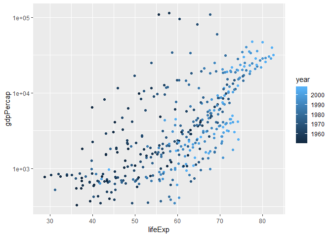
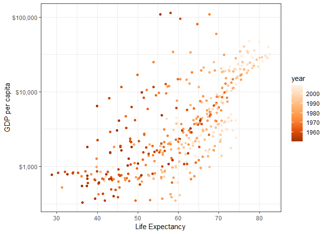
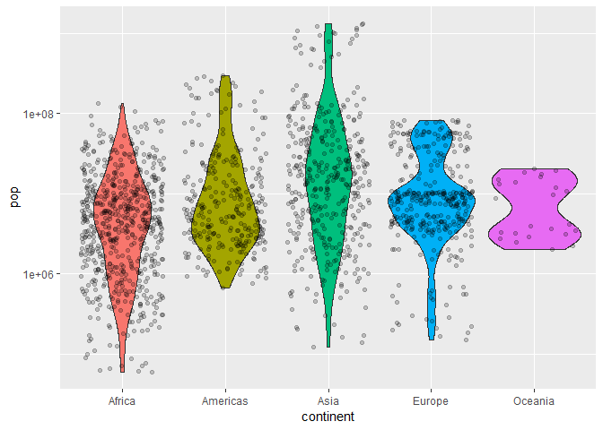

Homework 05
================

Homework 05: Factor and figure management
=========================================

``` r
library(tidyverse)
```

    ## -- Attaching packages ------------------------------------------------------------ tidyverse 1.2.1 --

    ## v ggplot2 3.0.0     v purrr   0.2.5
    ## v tibble  1.4.2     v dplyr   0.7.6
    ## v tidyr   0.8.1     v stringr 1.3.1
    ## v readr   1.1.1     v forcats 0.3.0

    ## -- Conflicts --------------------------------------------------------------- tidyverse_conflicts() --
    ## x dplyr::filter() masks stats::filter()
    ## x dplyr::lag()    masks stats::lag()

``` r
library(gapminder)
library(knitr)
library(scales)
```

    ## 
    ## Attaching package: 'scales'

    ## The following object is masked from 'package:purrr':
    ## 
    ##     discard

    ## The following object is masked from 'package:readr':
    ## 
    ##     col_factor

``` r
library(plotly)
```

    ## 
    ## Attaching package: 'plotly'

    ## The following object is masked from 'package:ggplot2':
    ## 
    ##     last_plot

    ## The following object is masked from 'package:stats':
    ## 
    ##     filter

    ## The following object is masked from 'package:graphics':
    ## 
    ##     layout

Part 1: Factor management
-------------------------

### Elaboration for the gapminder data set

Drop Oceania. Filter the Gapminder data to remove observations associated with the continent of Oceania. Additionally, remove unused factor levels. Provide concrete information on the data before and after removing these rows and Oceania; address the number of rows and the levels of the affected factors.

``` r
str(gapminder)
```

    ## Classes 'tbl_df', 'tbl' and 'data.frame':    1704 obs. of  6 variables:
    ##  $ country  : Factor w/ 142 levels "Afghanistan",..: 1 1 1 1 1 1 1 1 1 1 ...
    ##  $ continent: Factor w/ 5 levels "Africa","Americas",..: 3 3 3 3 3 3 3 3 3 3 ...
    ##  $ year     : int  1952 1957 1962 1967 1972 1977 1982 1987 1992 1997 ...
    ##  $ lifeExp  : num  28.8 30.3 32 34 36.1 ...
    ##  $ pop      : int  8425333 9240934 10267083 11537966 13079460 14880372 12881816 13867957 16317921 22227415 ...
    ##  $ gdpPercap: num  779 821 853 836 740 ...

We can see 132 levels in country and 5 levels in continent. There are 1704 rows in total.

``` r
gap_filter <- gapminder%>%
  filter(continent != "Oceania")

str(gap_filter)
```

    ## Classes 'tbl_df', 'tbl' and 'data.frame':    1680 obs. of  6 variables:
    ##  $ country  : Factor w/ 142 levels "Afghanistan",..: 1 1 1 1 1 1 1 1 1 1 ...
    ##  $ continent: Factor w/ 5 levels "Africa","Americas",..: 3 3 3 3 3 3 3 3 3 3 ...
    ##  $ year     : int  1952 1957 1962 1967 1972 1977 1982 1987 1992 1997 ...
    ##  $ lifeExp  : num  28.8 30.3 32 34 36.1 ...
    ##  $ pop      : int  8425333 9240934 10267083 11537966 13079460 14880372 12881816 13867957 16317921 22227415 ...
    ##  $ gdpPercap: num  779 821 853 836 740 ...

``` r
levels(gap_filter$continent)
```

    ## [1] "Africa"   "Americas" "Asia"     "Europe"   "Oceania"

We can still see 142 levels in country and 5 levels in continent. So empty unused levels like "oceania" persist. However, there are 1680 rows in total.

``` r
gap_filter %>%
  droplevels() %>%
  str()
```

    ## Classes 'tbl_df', 'tbl' and 'data.frame':    1680 obs. of  6 variables:
    ##  $ country  : Factor w/ 140 levels "Afghanistan",..: 1 1 1 1 1 1 1 1 1 1 ...
    ##  $ continent: Factor w/ 4 levels "Africa","Americas",..: 3 3 3 3 3 3 3 3 3 3 ...
    ##  $ year     : int  1952 1957 1962 1967 1972 1977 1982 1987 1992 1997 ...
    ##  $ lifeExp  : num  28.8 30.3 32 34 36.1 ...
    ##  $ pop      : int  8425333 9240934 10267083 11537966 13079460 14880372 12881816 13867957 16317921 22227415 ...
    ##  $ gdpPercap: num  779 821 853 836 740 ...

``` r
gap_filter$continent %>%
  droplevels() %>%
  levels()
```

    ## [1] "Africa"   "Americas" "Asia"     "Europe"

After `droplevels`, we can see that the number of rows is still 1680. However, the unused factors are removed. There are only 140 levels in country and 4 levels in continent. Indeed "Oceania", which is unused, is removed.

Reorder the levels of country or continent. Use the forcats package to change the order of the factor levels, based on a principled summary of one of the quantitative variables. Consider experimenting with a summary statistic beyond the most basic choice of the median.

I'll look at Europe in 1952.

``` r
gap_europe1952 <- gapminder %>%
  filter(year == 1952, continent == "Europe")

#Head the filtered file
gap_europe1952 %>%
  head(15) %>%
  kable()
```

| country                | continent |  year|  lifeExp|       pop|  gdpPercap|
|:-----------------------|:----------|-----:|--------:|---------:|----------:|
| Albania                | Europe    |  1952|    55.23|   1282697|  1601.0561|
| Austria                | Europe    |  1952|    66.80|   6927772|  6137.0765|
| Belgium                | Europe    |  1952|    68.00|   8730405|  8343.1051|
| Bosnia and Herzegovina | Europe    |  1952|    53.82|   2791000|   973.5332|
| Bulgaria               | Europe    |  1952|    59.60|   7274900|  2444.2866|
| Croatia                | Europe    |  1952|    61.21|   3882229|  3119.2365|
| Czech Republic         | Europe    |  1952|    66.87|   9125183|  6876.1403|
| Denmark                | Europe    |  1952|    70.78|   4334000|  9692.3852|
| Finland                | Europe    |  1952|    66.55|   4090500|  6424.5191|
| France                 | Europe    |  1952|    67.41|  42459667|  7029.8093|
| Germany                | Europe    |  1952|    67.50|  69145952|  7144.1144|
| Greece                 | Europe    |  1952|    65.86|   7733250|  3530.6901|
| Hungary                | Europe    |  1952|    64.03|   9504000|  5263.6738|
| Iceland                | Europe    |  1952|    72.49|    147962|  7267.6884|
| Ireland                | Europe    |  1952|    66.91|   2952156|  5210.2803|

Note the alphabetical order.

``` r
gap_europe1952 %>%
  ggplot(aes(country, gdpPercap, fill = country)) +
  geom_bar(stat = "identity", show.legend = FALSE) + #bar plot
  coord_flip() + #flip X and y
  theme_bw() #bw theme
```


We can see that the countries are ordered by alphabetical order still.

Let's try `arrange`.

``` r
gap_europe1952 %>%
  arrange(gdpPercap) %>%
  head(15) %>%
  kable()
```

| country                | continent |  year|  lifeExp|       pop|  gdpPercap|
|:-----------------------|:----------|-----:|--------:|---------:|----------:|
| Bosnia and Herzegovina | Europe    |  1952|   53.820|   2791000|   973.5332|
| Albania                | Europe    |  1952|   55.230|   1282697|  1601.0561|
| Turkey                 | Europe    |  1952|   43.585|  22235677|  1969.1010|
| Bulgaria               | Europe    |  1952|   59.600|   7274900|  2444.2866|
| Montenegro             | Europe    |  1952|   59.164|    413834|  2647.5856|
| Portugal               | Europe    |  1952|   59.820|   8526050|  3068.3199|
| Croatia                | Europe    |  1952|   61.210|   3882229|  3119.2365|
| Romania                | Europe    |  1952|   61.050|  16630000|  3144.6132|
| Greece                 | Europe    |  1952|   65.860|   7733250|  3530.6901|
| Serbia                 | Europe    |  1952|   57.996|   6860147|  3581.4594|
| Spain                  | Europe    |  1952|   64.940|  28549870|  3834.0347|
| Poland                 | Europe    |  1952|   61.310|  25730551|  4029.3297|
| Slovenia               | Europe    |  1952|   65.570|   1489518|  4215.0417|
| Italy                  | Europe    |  1952|   65.940|  47666000|  4931.4042|
| Slovak Republic        | Europe    |  1952|   64.360|   3558137|  5074.6591|

We can see that the table is arranged by gdpPerCap now.

``` r
gap_europe1952 %>%
  arrange(gdpPercap) %>%
  ggplot(aes(country, gdpPercap, fill = country)) +
  geom_bar(stat = "identity", show.legend = FALSE) + #bar plot
  coord_flip() + #flip X and y
  theme_bw() #bw theme
```


But arrange has no effect on plotting order. This is still alphabetical on ggplot.

Let's try `fct_reorder`.

``` r
gap_europe1952 %>%
  mutate(country = fct_reorder(country, gdpPercap)) %>%
  head(15) %>%
  kable()
```

| country                | continent |  year|  lifeExp|       pop|  gdpPercap|
|:-----------------------|:----------|-----:|--------:|---------:|----------:|
| Albania                | Europe    |  1952|    55.23|   1282697|  1601.0561|
| Austria                | Europe    |  1952|    66.80|   6927772|  6137.0765|
| Belgium                | Europe    |  1952|    68.00|   8730405|  8343.1051|
| Bosnia and Herzegovina | Europe    |  1952|    53.82|   2791000|   973.5332|
| Bulgaria               | Europe    |  1952|    59.60|   7274900|  2444.2866|
| Croatia                | Europe    |  1952|    61.21|   3882229|  3119.2365|
| Czech Republic         | Europe    |  1952|    66.87|   9125183|  6876.1403|
| Denmark                | Europe    |  1952|    70.78|   4334000|  9692.3852|
| Finland                | Europe    |  1952|    66.55|   4090500|  6424.5191|
| France                 | Europe    |  1952|    67.41|  42459667|  7029.8093|
| Germany                | Europe    |  1952|    67.50|  69145952|  7144.1144|
| Greece                 | Europe    |  1952|    65.86|   7733250|  3530.6901|
| Hungary                | Europe    |  1952|    64.03|   9504000|  5263.6738|
| Iceland                | Europe    |  1952|    72.49|    147962|  7267.6884|
| Ireland                | Europe    |  1952|    66.91|   2952156|  5210.2803|

We can see that the table is not reordered with `fct_reorder`. It is still alphabetical order.

``` r
gap_europe1952 %>%
  mutate(country = fct_reorder(country, gdpPercap)) %>%
  ggplot(aes(country, gdpPercap, fill = country)) +
  geom_bar(stat = "identity", show.legend = FALSE) + #bar plot
  coord_flip() + #flip X and y
  theme_bw() #bw theme
```


However, the plot is reordered by gdpPerCap.

So we need both `arrange` for the table and `fct_reorder` for the plot.

``` r
gap_europe1952 %>%
  arrange(gdpPercap) %>%
  mutate(country = fct_reorder(country, gdpPercap)) %>%
  head(15) %>%
  kable()
```

| country                | continent |  year|  lifeExp|       pop|  gdpPercap|
|:-----------------------|:----------|-----:|--------:|---------:|----------:|
| Bosnia and Herzegovina | Europe    |  1952|   53.820|   2791000|   973.5332|
| Albania                | Europe    |  1952|   55.230|   1282697|  1601.0561|
| Turkey                 | Europe    |  1952|   43.585|  22235677|  1969.1010|
| Bulgaria               | Europe    |  1952|   59.600|   7274900|  2444.2866|
| Montenegro             | Europe    |  1952|   59.164|    413834|  2647.5856|
| Portugal               | Europe    |  1952|   59.820|   8526050|  3068.3199|
| Croatia                | Europe    |  1952|   61.210|   3882229|  3119.2365|
| Romania                | Europe    |  1952|   61.050|  16630000|  3144.6132|
| Greece                 | Europe    |  1952|   65.860|   7733250|  3530.6901|
| Serbia                 | Europe    |  1952|   57.996|   6860147|  3581.4594|
| Spain                  | Europe    |  1952|   64.940|  28549870|  3834.0347|
| Poland                 | Europe    |  1952|   61.310|  25730551|  4029.3297|
| Slovenia               | Europe    |  1952|   65.570|   1489518|  4215.0417|
| Italy                  | Europe    |  1952|   65.940|  47666000|  4931.4042|
| Slovak Republic        | Europe    |  1952|   64.360|   3558137|  5074.6591|

Table is ordered by gdpPerCap...

``` r
gap_europe1952 %>%
  arrange(gdpPercap) %>%
  mutate(country = fct_reorder(country, gdpPercap)) %>%
  ggplot(aes(country, gdpPercap, fill = country)) +
  geom_bar(stat = "identity", show.legend = FALSE) + #bar plot
  coord_flip() + #flip X and y
  theme_bw() #bw theme
```


...And the plot is reordered.

Part 2: File I/O
----------------

Experiment with one or more of write\_csv()/read\_csv() (and/or TSV friends), saveRDS()/readRDS(), dput()/dget(). Create something new, probably by filtering or grouped-summarization of Singer or Gapminder. I highly recommend you fiddle with the factor levels, i.e. make them non-alphabetical (see previous section). Explore whether this survives the round trip of writing to file then reading back in.

Explore the data first.

``` r
#Filter the data
gap_americas1997 <- gapminder %>%
  filter(year == 1997, continent == "Americas")

# Head data
gap_americas1997 %>%
  head(15) %>%
  kable()
```

| country            | continent |  year|  lifeExp|        pop|  gdpPercap|
|:-------------------|:----------|-----:|--------:|----------:|----------:|
| Argentina          | Americas  |  1997|   73.275|   36203463|  10967.282|
| Bolivia            | Americas  |  1997|   62.050|    7693188|   3326.143|
| Brazil             | Americas  |  1997|   69.388|  168546719|   7957.981|
| Canada             | Americas  |  1997|   78.610|   30305843|  28954.926|
| Chile              | Americas  |  1997|   75.816|   14599929|  10118.053|
| Colombia           | Americas  |  1997|   70.313|   37657830|   6117.362|
| Costa Rica         | Americas  |  1997|   77.260|    3518107|   6677.045|
| Cuba               | Americas  |  1997|   76.151|   10983007|   5431.990|
| Dominican Republic | Americas  |  1997|   69.957|    7992357|   3614.101|
| Ecuador            | Americas  |  1997|   72.312|   11911819|   7429.456|
| El Salvador        | Americas  |  1997|   69.535|    5783439|   5154.825|
| Guatemala          | Americas  |  1997|   66.322|    9803875|   4684.314|
| Haiti              | Americas  |  1997|   56.671|    6913545|   1341.727|
| Honduras           | Americas  |  1997|   67.659|    5867957|   3160.455|
| Jamaica            | Americas  |  1997|   72.262|    2531311|   7121.925|

Look at the `str`.

``` r
str(gapminder)
```

    ## Classes 'tbl_df', 'tbl' and 'data.frame':    1704 obs. of  6 variables:
    ##  $ country  : Factor w/ 142 levels "Afghanistan",..: 1 1 1 1 1 1 1 1 1 1 ...
    ##  $ continent: Factor w/ 5 levels "Africa","Americas",..: 3 3 3 3 3 3 3 3 3 3 ...
    ##  $ year     : int  1952 1957 1962 1967 1972 1977 1982 1987 1992 1997 ...
    ##  $ lifeExp  : num  28.8 30.3 32 34 36.1 ...
    ##  $ pop      : int  8425333 9240934 10267083 11537966 13079460 14880372 12881816 13867957 16317921 22227415 ...
    ##  $ gdpPercap: num  779 821 853 836 740 ...

``` r
str(gap_americas1997)
```

    ## Classes 'tbl_df', 'tbl' and 'data.frame':    25 obs. of  6 variables:
    ##  $ country  : Factor w/ 142 levels "Afghanistan",..: 5 12 15 21 24 26 30 33 37 38 ...
    ##  $ continent: Factor w/ 5 levels "Africa","Americas",..: 2 2 2 2 2 2 2 2 2 2 ...
    ##  $ year     : int  1997 1997 1997 1997 1997 1997 1997 1997 1997 1997 ...
    ##  $ lifeExp  : num  73.3 62 69.4 78.6 75.8 ...
    ##  $ pop      : int  36203463 7693188 168546719 30305843 14599929 37657830 3518107 10983007 7992357 11911819 ...
    ##  $ gdpPercap: num  10967 3326 7958 28955 10118 ...

We can see that gapminder has 1704 row and the filtered data only has 25 rows. However, the levels are the same. This is because gap\_americas1997 has unused levels.

Let's look at I/O.

``` r
# write the df
gap_americas1997 %>%
  write_csv("output/gap_americas1997_v1")

#Read
read_csv("output/gap_americas1997_v1") %>%
  str()
```

    ## Parsed with column specification:
    ## cols(
    ##   country = col_character(),
    ##   continent = col_character(),
    ##   year = col_integer(),
    ##   lifeExp = col_double(),
    ##   pop = col_integer(),
    ##   gdpPercap = col_double()
    ## )

    ## Classes 'tbl_df', 'tbl' and 'data.frame':    25 obs. of  6 variables:
    ##  $ country  : chr  "Argentina" "Bolivia" "Brazil" "Canada" ...
    ##  $ continent: chr  "Americas" "Americas" "Americas" "Americas" ...
    ##  $ year     : int  1997 1997 1997 1997 1997 1997 1997 1997 1997 1997 ...
    ##  $ lifeExp  : num  73.3 62 69.4 78.6 75.8 ...
    ##  $ pop      : int  36203463 7693188 168546719 30305843 14599929 37657830 3518107 10983007 7992357 11911819 ...
    ##  $ gdpPercap: num  10967 3326 7958 28955 10118 ...
    ##  - attr(*, "spec")=List of 2
    ##   ..$ cols   :List of 6
    ##   .. ..$ country  : list()
    ##   .. .. ..- attr(*, "class")= chr  "collector_character" "collector"
    ##   .. ..$ continent: list()
    ##   .. .. ..- attr(*, "class")= chr  "collector_character" "collector"
    ##   .. ..$ year     : list()
    ##   .. .. ..- attr(*, "class")= chr  "collector_integer" "collector"
    ##   .. ..$ lifeExp  : list()
    ##   .. .. ..- attr(*, "class")= chr  "collector_double" "collector"
    ##   .. ..$ pop      : list()
    ##   .. .. ..- attr(*, "class")= chr  "collector_integer" "collector"
    ##   .. ..$ gdpPercap: list()
    ##   .. .. ..- attr(*, "class")= chr  "collector_double" "collector"
    ##   ..$ default: list()
    ##   .. ..- attr(*, "class")= chr  "collector_guess" "collector"
    ##   ..- attr(*, "class")= chr "col_spec"

We can see that after writing and reading the data, the levels are not maintained. This info is not stored in the written file.

Let's try reordering now.

``` r
gap_americas1997 %>%
  mutate(country = fct_reorder(country, lifeExp)) %>% # reorder factor by lifeExp
  str()
```

    ## Classes 'tbl_df', 'tbl' and 'data.frame':    25 obs. of  6 variables:
    ##  $ country  : Factor w/ 142 levels "Haiti","Bolivia",..: 16 2 7 25 21 12 24 22 11 15 ...
    ##  $ continent: Factor w/ 5 levels "Africa","Americas",..: 2 2 2 2 2 2 2 2 2 2 ...
    ##  $ year     : int  1997 1997 1997 1997 1997 1997 1997 1997 1997 1997 ...
    ##  $ lifeExp  : num  73.3 62 69.4 78.6 75.8 ...
    ##  $ pop      : int  36203463 7693188 168546719 30305843 14599929 37657830 3518107 10983007 7992357 11911819 ...
    ##  $ gdpPercap: num  10967 3326 7958 28955 10118 ...

We can see that the factors for lifeExp are reordered.

``` r
gap_americas1997 %>%
  mutate(country = fct_reorder(country, lifeExp)) %>% # reorder factor by lifeExp
  ggplot(aes(country, lifeExp)) +
  geom_point() + #Scatter plot
  coord_flip() + #flip X and y
  theme_bw() #bw theme
```


So the plot is now ordered by lifeExp.

Let's do another round of I/O

``` r
# write the df
gap_americas1997 %>%
  mutate(country = fct_reorder(country, lifeExp)) %>%
  write_csv("output/gap_americas1997_v2")

#read
read_csv("output/gap_americas1997_v2") %>%
  str()
```

    ## Parsed with column specification:
    ## cols(
    ##   country = col_character(),
    ##   continent = col_character(),
    ##   year = col_integer(),
    ##   lifeExp = col_double(),
    ##   pop = col_integer(),
    ##   gdpPercap = col_double()
    ## )

    ## Classes 'tbl_df', 'tbl' and 'data.frame':    25 obs. of  6 variables:
    ##  $ country  : chr  "Argentina" "Bolivia" "Brazil" "Canada" ...
    ##  $ continent: chr  "Americas" "Americas" "Americas" "Americas" ...
    ##  $ year     : int  1997 1997 1997 1997 1997 1997 1997 1997 1997 1997 ...
    ##  $ lifeExp  : num  73.3 62 69.4 78.6 75.8 ...
    ##  $ pop      : int  36203463 7693188 168546719 30305843 14599929 37657830 3518107 10983007 7992357 11911819 ...
    ##  $ gdpPercap: num  10967 3326 7958 28955 10118 ...
    ##  - attr(*, "spec")=List of 2
    ##   ..$ cols   :List of 6
    ##   .. ..$ country  : list()
    ##   .. .. ..- attr(*, "class")= chr  "collector_character" "collector"
    ##   .. ..$ continent: list()
    ##   .. .. ..- attr(*, "class")= chr  "collector_character" "collector"
    ##   .. ..$ year     : list()
    ##   .. .. ..- attr(*, "class")= chr  "collector_integer" "collector"
    ##   .. ..$ lifeExp  : list()
    ##   .. .. ..- attr(*, "class")= chr  "collector_double" "collector"
    ##   .. ..$ pop      : list()
    ##   .. .. ..- attr(*, "class")= chr  "collector_integer" "collector"
    ##   .. ..$ gdpPercap: list()
    ##   .. .. ..- attr(*, "class")= chr  "collector_double" "collector"
    ##   ..$ default: list()
    ##   .. ..- attr(*, "class")= chr  "collector_guess" "collector"
    ##   ..- attr(*, "class")= chr "col_spec"

As we can see, after a round of I/O, nothing is maintained except that values themselves. We do not have any ordering of factors.

``` r
read_csv("output/gap_americas1997_v2") %>%
  ggplot(aes(country, lifeExp)) +
  geom_point() + #Scatter plot
  coord_flip() + #flip X and y
  theme_bw() #bw theme
```

    ## Parsed with column specification:
    ## cols(
    ##   country = col_character(),
    ##   continent = col_character(),
    ##   year = col_integer(),
    ##   lifeExp = col_double(),
    ##   pop = col_integer(),
    ##   gdpPercap = col_double()
    ## )


As expected, when we plot, this is back to alphabetical order.

What if we want to write/read and maintain some order? We would use `arrange`.

``` r
# Arrange
gap_americas1997 %>%
  arrange(lifeExp) %>%
  head(15) %>%
  kable()
```

| country             | continent |  year|  lifeExp|        pop|  gdpPercap|
|:--------------------|:----------|-----:|--------:|----------:|----------:|
| Haiti               | Americas  |  1997|   56.671|    6913545|   1341.727|
| Bolivia             | Americas  |  1997|   62.050|    7693188|   3326.143|
| Guatemala           | Americas  |  1997|   66.322|    9803875|   4684.314|
| Honduras            | Americas  |  1997|   67.659|    5867957|   3160.455|
| Peru                | Americas  |  1997|   68.386|   24748122|   5838.348|
| Nicaragua           | Americas  |  1997|   68.426|    4609572|   2253.023|
| Brazil              | Americas  |  1997|   69.388|  168546719|   7957.981|
| Paraguay            | Americas  |  1997|   69.400|    5154123|   4247.400|
| Trinidad and Tobago | Americas  |  1997|   69.465|    1138101|   8792.573|
| El Salvador         | Americas  |  1997|   69.535|    5783439|   5154.825|
| Dominican Republic  | Americas  |  1997|   69.957|    7992357|   3614.101|
| Colombia            | Americas  |  1997|   70.313|   37657830|   6117.362|
| Venezuela           | Americas  |  1997|   72.146|   22374398|  10165.495|
| Jamaica             | Americas  |  1997|   72.262|    2531311|   7121.925|
| Ecuador             | Americas  |  1997|   72.312|   11911819|   7429.456|

We can see that the df is ordered by lifeExp here. Let's now output and input that.

``` r
# Write the df
gap_americas1997 %>%
  arrange(lifeExp) %>%
  write_csv("output/gap_americas1997_v3")

# Read it back in
read_csv("output/gap_americas1997_v3") %>% 
  head(15) %>%
  kable()
```

    ## Parsed with column specification:
    ## cols(
    ##   country = col_character(),
    ##   continent = col_character(),
    ##   year = col_integer(),
    ##   lifeExp = col_double(),
    ##   pop = col_integer(),
    ##   gdpPercap = col_double()
    ## )

| country             | continent |  year|  lifeExp|        pop|  gdpPercap|
|:--------------------|:----------|-----:|--------:|----------:|----------:|
| Haiti               | Americas  |  1997|   56.671|    6913545|   1341.727|
| Bolivia             | Americas  |  1997|   62.050|    7693188|   3326.143|
| Guatemala           | Americas  |  1997|   66.322|    9803875|   4684.314|
| Honduras            | Americas  |  1997|   67.659|    5867957|   3160.455|
| Peru                | Americas  |  1997|   68.386|   24748122|   5838.348|
| Nicaragua           | Americas  |  1997|   68.426|    4609572|   2253.023|
| Brazil              | Americas  |  1997|   69.388|  168546719|   7957.981|
| Paraguay            | Americas  |  1997|   69.400|    5154123|   4247.400|
| Trinidad and Tobago | Americas  |  1997|   69.465|    1138101|   8792.573|
| El Salvador         | Americas  |  1997|   69.535|    5783439|   5154.825|
| Dominican Republic  | Americas  |  1997|   69.957|    7992357|   3614.101|
| Colombia            | Americas  |  1997|   70.313|   37657830|   6117.362|
| Venezuela           | Americas  |  1997|   72.146|   22374398|  10165.495|
| Jamaica             | Americas  |  1997|   72.262|    2531311|   7121.925|
| Ecuador             | Americas  |  1997|   72.312|   11911819|   7429.456|

We can see that the arranged order by lifeExp is maintained.

``` r
read_csv("output/gap_americas1997_v3") %>% 
  ggplot(aes(country, lifeExp)) +
  geom_point() + #Scatter plot
  coord_flip() + #flip X and y
  theme_bw() #bw theme
```

    ## Parsed with column specification:
    ## cols(
    ##   country = col_character(),
    ##   continent = col_character(),
    ##   year = col_integer(),
    ##   lifeExp = col_double(),
    ##   pop = col_integer(),
    ##   gdpPercap = col_double()
    ## )


But when we plot, we are back to alphabetical order.

``` r
read_csv("output/gap_americas1997_v3") %>% 
  ggplot(aes(reorder(country, lifeExp), lifeExp)) +
  geom_point() + #Scatter plot
  coord_flip() + #flip X and y
  theme_bw() #bw theme
```

    ## Parsed with column specification:
    ## cols(
    ##   country = col_character(),
    ##   continent = col_character(),
    ##   year = col_integer(),
    ##   lifeExp = col_double(),
    ##   pop = col_integer(),
    ##   gdpPercap = col_double()
    ## )


We can use `reorder` since we do not have ordered levels here.

Part 3: Visualization design
----------------------------

Remake at least one figure or create a new one, in light of something you learned in the recent class meetings about visualization design and color. Maybe juxtapose your first attempt and what you obtained after some time spent working on it. Reflect on the differences. If using Gapminder, you can use the country or continent color scheme that ships with Gapminder. Consult the dimensions listed in All the Graph Things.

I'll be replotting some of my plots from previous assignments.

OLD:

``` r
gapminder %>%
  filter(continent == "Asia") %>%
  ggplot(aes(x = lifeExp, y = gdpPercap, colour = year)) +
  geom_point() +
  scale_y_log10()
```



NEW:

``` r
gapminder %>%
  filter(continent == "Asia") %>%
  ggplot(aes(x = lifeExp, y = gdpPercap, colour = year)) +
  geom_point() +
  scale_y_continuous(
    label=dollar_format(), # add $ format
    trans  = "log10") + #y axis on log scale
  scale_color_distiller(
    palette = "Oranges") + #Orange palette
  theme_bw() + # change theme
  ylab("GDP per capita") + # change title on Y axis
  xlab("Life Expectancy") #change title on X axis
```



So here, I've re-plotted a scatterplot from HW02. I've changed the theme, the color scale, the titles on the axes, added a dollar format, and transformed the Y axis to a log10 scale.

Here is another plot.

OLD:

``` r
ggplot(gapminder, aes(x = continent, y = pop)) +
  scale_y_log10() +
  geom_violin(aes(fill = continent), show.legend = FALSE) +
  geom_jitter(alpha = 0.2)
```



NEW:

``` r
ggplot(gapminder, aes(x = continent, y = pop)) +
  geom_violin(show.legend = FALSE, aes(fill = continent)) +
  geom_jitter(alpha = 0.2) +
  scale_y_continuous(
    label=comma_format(), # add comma format
    trans = "log10", #y axis on log scale
    breaks = 10^(1:10)) + # log 10 y scale
  scale_fill_brewer(
    palette = "Dark2") + #change fill 
  theme_bw() + #change theme to bw
  theme(
    axis.text = element_text(size = 14), #change size of axis labels
    axis.title = element_text(size = 16)) + #change size of axis text
  ylab("Population") + # Add Y label
  xlab("Continent") # Add X label
```


Here I've replotted the same violin and jitter. However, I added a comma format on the Y axis, changed the breaks, transformed to log10, changed the fill colour to "Dark2", changed the theme, increased the font size on the axis labels and titles, and changed the titles on the axes.

Then, make a new graph by converting this visual (or another, if you’d like) to a plotly graph. What are some things that plotly makes possible, that are not possible with a regular ggplot2 graph?

I'll replot the first plot as a plotly.

``` r
plot <- gapminder %>%
  filter(continent == "Asia") %>%
  ggplot(aes(x = lifeExp, y = gdpPercap, colour = year)) +
  geom_point() +
  scale_y_continuous(
    label=dollar_format(), # add $ format
    trans  = "log10") + #y axis on log scale
  scale_color_distiller(
    palette = "Oranges") + #Orange palette
  theme_bw() + # change theme
  ylab("GDP per capita") + # change title on Y axis
  xlab("Life Expectancy") #change title on X axis

ggplotly(plot) #Convert to plotly
```

<!--html_preserve-->

<script type="application/json" data-for="htmlwidget-8184b43d297385ad6c78">{"x":{"data":[{"x":[28.801,30.332,31.997,34.02,36.088,38.438,39.854,40.822,41.674,41.763,42.129,43.828,50.939,53.832,56.923,59.923,63.3,65.593,69.052,70.75,72.601,73.925,74.795,75.635,37.484,39.348,41.216,43.453,45.252,46.923,50.009,52.819,56.018,59.412,62.013,64.062,39.417,41.366,43.415,45.415,40.317,31.22,50.957,53.914,55.803,56.534,56.752,59.723,44,50.54896,44.50136,58.38112,63.11888,63.96736,65.525,67.274,68.69,70.426,72.028,72.961,60.96,64.75,67.65,70,72,73.6,75.45,76.2,77.601,80,81.495,82.208,37.373,40.249,43.605,47.193,50.651,54.208,56.596,58.553,60.223,61.765,62.879,64.698,37.468,39.918,42.518,45.964,49.203,52.702,56.159,60.137,62.681,66.041,68.588,70.65,44.869,47.181,49.325,52.469,55.234,57.702,59.62,63.04,65.742,68.042,69.451,70.964,45.32,48.437,51.457,54.459,56.95,60.413,62.038,65.044,59.461,58.811,57.046,59.545,65.39,67.84,69.39,70.75,71.63,73.06,74.45,75.6,76.93,78.269,79.696,80.745,63.03,65.5,68.73,71.43,73.42,75.38,77.11,78.67,79.36,80.69,82,82.603,43.158,45.669,48.126,51.629,56.528,61.134,63.739,65.869,68.015,69.772,71.263,72.535,50.056,54.081,56.656,59.942,63.983,67.159,69.1,70.647,69.978,67.727,66.662,67.297,47.453,52.681,55.292,57.716,62.612,64.766,67.123,69.81,72.244,74.647,77.045,78.623,55.565,58.033,60.47,64.624,67.712,69.343,71.309,74.174,75.19,76.156,76.904,77.588,55.928,59.489,62.094,63.87,65.421,66.099,66.983,67.926,69.292,70.265,71.028,71.993,48.463,52.102,55.737,59.371,63.01,65.256,68,69.5,70.693,71.938,73.044,74.241,42.244,45.248,48.251,51.253,53.754,55.491,57.489,60.222,61.271,63.625,65.033,66.803,36.319,41.905,45.108,49.379,53.07,56.059,58.056,58.339,59.32,60.328,59.908,62.069,36.157,37.686,39.393,41.472,43.971,46.748,49.594,52.537,55.727,59.426,61.34,63.785,37.578,40.08,43.165,46.988,52.143,57.367,62.728,67.734,71.197,72.499,74.193,75.64,43.436,45.557,47.67,49.8,51.929,54.043,56.158,58.245,60.838,61.818,63.61,65.483,47.752,51.334,54.757,56.393,58.065,60.06,62.082,64.151,66.458,68.564,70.303,71.688,39.875,42.868,45.914,49.901,53.886,58.69,63.012,66.295,68.768,70.533,71.626,72.777,60.396,63.179,65.798,67.946,69.521,70.795,71.76,73.56,75.788,77.158,78.77,79.972,57.593,61.456,62.192,64.266,65.042,65.949,68.757,69.011,70.379,70.457,70.815,72.396,45.883,48.284,50.305,53.655,57.296,61.195,64.59,66.974,69.249,71.527,73.053,74.143,58.5,62.4,65.2,67.5,69.39,70.59,72.16,73.4,74.26,75.25,76.99,78.4,50.848,53.63,56.061,58.285,60.405,62.494,64.597,66.084,67.298,67.521,68.564,70.616,40.412,42.887,45.363,47.838,50.254,55.764,58.816,62.82,67.662,70.672,73.017,74.249,43.16,45.671,48.127,51.631,56.532,60.765,64.406,67.046,69.718,71.096,72.37,73.422,32.548,33.97,35.18,36.984,39.848,44.175,49.113,52.922,55.599,58.02,60.308,62.698],"y":[2.89178565070639,2.91426540541726,2.93100030340142,2.92230867688807,2.86922063087752,2.89548517717506,2.99034393431589,2.93064137492864,2.81247308981853,2.80300712218037,2.86137551173474,2.98881764549129,3.99418885910468,4.065796227313,4.10562172928569,4.17039881049903,4.2617066548942,4.28645875933068,4.28355330216118,4.26773533640728,4.27956609504629,4.30732521298902,4.36928191099016,4.47415867018597,2.83521110677235,2.82062008422877,2.8365402935719,2.85804733931374,2.79950157150347,2.81946314412135,2.83057703533901,2.87620594555335,2.92314562491112,2.9880101843097,3.05552756769812,3.143406361057,2.56640129232975,2.63752809023067,2.69628092469075,2.71886053038935,2.62492535061919,2.72013629197205,2.79551538938004,2.83498979258954,2.83397739252997,2.86586475706223,2.95241754629121,3.23395473727517,2.60254679160356,2.76041268220602,2.68812961839756,2.78725191591334,2.83052457318799,2.86995736499049,2.98336526243032,3.13953403709412,3.21900372308954,3.35969021328296,3.49405448539833,3.6954041667466,3.48492892667285,3.55979611796728,3.67141800376416,3.7922489662687,3.91991072809031,4.048680298964,4.16317719869737,4.30186461701644,4.39370859471309,4.45297615540202,4.48013656712865,4.59906367268864,2.73764241302062,2.77089764402555,2.8184549604276,2.84557587986314,2.85975807721828,2.91027070197067,2.93233347794306,2.98967788500985,3.06610473636011,3.16400094721034,3.24223558874779,3.38955773121288,2.8748768833905,2.93394273961808,2.92905589293455,2.88220098595162,3.04575623818387,3.14072860861607,3.18094921762256,3.24263010699728,3.37714971981812,3.49406210213458,3.45847359725269,3.54908318988216,3.48220534228651,3.51722990662846,3.62193716809161,3.77134725217608,3.98289592362557,4.07513053543838,3.88128960390396,3.82235649685219,3.8594777425234,3.91716877724031,3.96570778376274,4.06467188236304,3.61592545033292,3.79444158665475,3.92125653563111,3.95092244836757,3.98118584246344,4.16696961434647,4.16190401332754,4.06608625841883,3.57352611389943,3.48802018600138,3.64253547677859,3.65041068311967,3.61135385491083,3.73120816382831,3.85160263257717,3.92395558525362,4.10676636344731,4.12406772903255,4.18658991650744,4.23356666405139,4.25651383797765,4.32007582162183,4.34055505676126,4.40693643553008,3.50744516771402,3.6352518968468,3.8180046943436,3.99333871744166,4.16963877108206,4.22037948985684,4.28744576953352,4.3497813255084,4.42853803247444,4.45964251194375,4.45643575609251,4.50045697098462,3.18946443127902,3.27556024591924,3.37069978646872,3.43803517841855,3.32445867085747,3.45520305365965,3.61924112835474,3.64823115884918,3.53549585513414,3.56174275554633,3.58488699106174,3.65508665949928,3.0367397532404,3.19621340809367,3.20996880223764,3.3311317155572,3.56839200934875,3.61345080718246,3.6134745020876,3.61347101441374,3.57125025273538,3.2280811463719,3.21662982175713,3.20223362703668,3.0130868621518,3.1724842828549,3.18648857807127,3.30733087662514,3.48156826189899,3.66812684894598,3.74996363967246,3.9311062654171,4.08293891544179,4.20394427391255,4.28406934482008,4.3682522837381,5.03495857498782,5.05508436784766,4.97981283941297,4.90792105261074,5.0388103158678,4.7728017852095,4.49629344891365,4.4489910677682,4.54323488420159,4.60531172711223,4.54543213642878,4.67492531406996,3.68437887876133,3.78460209805048,3.75698284338325,3.77865640591502,3.87427211945096,3.93750268823479,3.88312288965326,3.73054741295915,3.83827007701996,3.94225435718384,3.96913338134411,4.01957563822304,3.26271986425609,3.25769464874627,3.30896649802464,3.35750460546659,3.45470689702688,3.58296303108212,3.69199652186561,3.72014297801091,3.86200684792003,4.00573416985715,4.00889717614582,4.09522710701315,2.89573564318216,2.9603102579863,3.02380946388826,3.08850503970313,3.15282078556282,3.21682849824462,3.30116094588944,3.36884604933009,3.25173602082497,3.27926807221425,3.33056378664279,3.49076900592376,2.51982799377572,2.54406804435028,2.58883172559421,2.54282542695918,2.55266821611219,2.56937390961505,2.62736585659273,2.5854607295085,2.54032947479087,2.61804809671209,2.78604121024255,2.97497199429807,2.73708582406826,2.77665496024957,2.81451186163868,2.83023070963807,2.82916743418004,2.84142982784579,2.85635005828879,2.8896559703455,2.95315075053154,3.0047048189239,3.02415974699117,3.03796794384465,3.26203090406686,3.35078019746999,3.46607213528986,3.67402872805872,4.02604429776365,4.07365765189317,4.11243041122876,4.25804368772363,4.26990286153798,4.2945115449614,4.29611290952744,4.34862010618943,2.83543508289054,2.87336916171177,2.90490087418869,2.9742390834018,3.02116406003658,3.07037821749517,3.15939567680982,3.23164454298501,3.29486935175814,3.31161624650109,3.32070955616155,3.41596567540354,3.10478780221552,3.18975548194558,3.21736605095263,3.25866779000196,3.29871645293952,3.37533512418369,3.41551984170779,3.34037172540222,3.35780606664274,3.40424084640125,3.42339679667222,3.50385616482709,3.81020258849406,3.91156194035525,4.06544599828818,4.22796504684151,4.39510663253032,4.53361654092087,4.52754194088831,4.32630024240411,4.3951798751481,4.31358652885387,4.27908585036826,4.33555481758265,3.3645769259938,3.45379280883569,3.5652260934194,3.6970041611318,3.93438512609999,4.04960907918865,4.18096156423903,4.27557693735977,4.39392409898215,4.52529722858871,4.5565811487931,4.67341887079622,3.0348417539084,3.03041617130128,3.03119508639222,3.05519261778385,3.08400239072348,3.12993971717703,3.21697823350406,3.27341031841906,3.33319311711301,3.42561201761444,3.47934188189776,3.59880094359832,3.2157658381984,3.32576904275003,3.34104598531203,3.27460199588512,3.41017352648115,3.50453672644772,3.57540005623291,3.49370535205919,3.52381703627158,3.60360322294262,3.61182155267593,3.62164856315343,3.08168852810498,3.1783613920919,3.26075784846008,3.4222382376131,3.60879592864655,3.74791804661293,3.87077569262919,4.04354152996951,4.18229073527864,4.3054979938992,4.36615058862194,4.45815837772449,2.8795531210227,2.89958929930828,3.00095403959985,3.11242422905142,3.18308724099962,3.29252733979409,3.37898258381719,3.47460284330426,3.66435014302872,3.76735073498212,3.77182165229835,3.87264545733796,2.78180310257259,2.83013004244803,2.8876449549003,2.80422348009232,2.84478873958942,2.85341657088882,2.84956422796571,2.91423705405801,2.99520645664776,3.14173088227915,3.24661099952182,3.38767031916547,3.18058239847588,3.26175464994224,3.34221660105438,3.42319916542994,3.49601712489568,3.56618184839601,3.6370924868569,3.70818264288109,3.7794272678399,3.85191037845634,3.6547046515929,3.4807755960326,2.89304987672292,2.90570440168043,2.91678188843888,2.9357299717043,3.10210667169689,3.26239535810376,3.29612901240816,3.29484998566756,3.27404156128206,3.32582024530859,3.34924271003421,3.35808147396803],"text":["lifeExp: 28.80100<br />gdpPercap:    779.4453<br />year: 1952","lifeExp: 30.33200<br />gdpPercap:    820.8530<br />year: 1957","lifeExp: 31.99700<br />gdpPercap:    853.1007<br />year: 1962","lifeExp: 34.02000<br />gdpPercap:    836.1971<br />year: 1967","lifeExp: 36.08800<br />gdpPercap:    739.9811<br />year: 1972","lifeExp: 38.43800<br />gdpPercap:    786.1134<br />year: 1977","lifeExp: 39.85400<br />gdpPercap:    978.0114<br />year: 1982","lifeExp: 40.82200<br />gdpPercap:    852.3959<br />year: 1987","lifeExp: 41.67400<br />gdpPercap:    649.3414<br />year: 1992","lifeExp: 41.76300<br />gdpPercap:    635.3414<br />year: 1997","lifeExp: 42.12900<br />gdpPercap:    726.7341<br />year: 2002","lifeExp: 43.82800<br />gdpPercap:    974.5803<br />year: 2007","lifeExp: 50.93900<br />gdpPercap:   9867.0848<br />year: 1952","lifeExp: 53.83200<br />gdpPercap:  11635.7995<br />year: 1957","lifeExp: 56.92300<br />gdpPercap:  12753.2751<br />year: 1962","lifeExp: 59.92300<br />gdpPercap:  14804.6727<br />year: 1967","lifeExp: 63.30000<br />gdpPercap:  18268.6584<br />year: 1972","lifeExp: 65.59300<br />gdpPercap:  19340.1020<br />year: 1977","lifeExp: 69.05200<br />gdpPercap:  19211.1473<br />year: 1982","lifeExp: 70.75000<br />gdpPercap:  18524.0241<br />year: 1987","lifeExp: 72.60100<br />gdpPercap:  19035.5792<br />year: 1992","lifeExp: 73.92500<br />gdpPercap:  20292.0168<br />year: 1997","lifeExp: 74.79500<br />gdpPercap:  23403.5593<br />year: 2002","lifeExp: 75.63500<br />gdpPercap:  29796.0483<br />year: 2007","lifeExp: 37.48400<br />gdpPercap:    684.2442<br />year: 1952","lifeExp: 39.34800<br />gdpPercap:    661.6375<br />year: 1957","lifeExp: 41.21600<br />gdpPercap:    686.3416<br />year: 1962","lifeExp: 43.45300<br />gdpPercap:    721.1861<br />year: 1967","lifeExp: 45.25200<br />gdpPercap:    630.2336<br />year: 1972","lifeExp: 46.92300<br />gdpPercap:    659.8772<br />year: 1977","lifeExp: 50.00900<br />gdpPercap:    676.9819<br />year: 1982","lifeExp: 52.81900<br />gdpPercap:    751.9794<br />year: 1987","lifeExp: 56.01800<br />gdpPercap:    837.8102<br />year: 1992","lifeExp: 59.41200<br />gdpPercap:    972.7700<br />year: 1997","lifeExp: 62.01300<br />gdpPercap:   1136.3904<br />year: 2002","lifeExp: 64.06200<br />gdpPercap:   1391.2538<br />year: 2007","lifeExp: 39.41700<br />gdpPercap:    368.4693<br />year: 1952","lifeExp: 41.36600<br />gdpPercap:    434.0383<br />year: 1957","lifeExp: 43.41500<br />gdpPercap:    496.9136<br />year: 1962","lifeExp: 45.41500<br />gdpPercap:    523.4323<br />year: 1967","lifeExp: 40.31700<br />gdpPercap:    421.6240<br />year: 1972","lifeExp: 31.22000<br />gdpPercap:    524.9722<br />year: 1977","lifeExp: 50.95700<br />gdpPercap:    624.4755<br />year: 1982","lifeExp: 53.91400<br />gdpPercap:    683.8956<br />year: 1987","lifeExp: 55.80300<br />gdpPercap:    682.3032<br />year: 1992","lifeExp: 56.53400<br />gdpPercap:    734.2852<br />year: 1997","lifeExp: 56.75200<br />gdpPercap:    896.2260<br />year: 2002","lifeExp: 59.72300<br />gdpPercap:   1713.7787<br />year: 2007","lifeExp: 44.00000<br />gdpPercap:    400.4486<br />year: 1952","lifeExp: 50.54896<br />gdpPercap:    575.9870<br />year: 1957","lifeExp: 44.50136<br />gdpPercap:    487.6740<br />year: 1962","lifeExp: 58.38112<br />gdpPercap:    612.7057<br />year: 1967","lifeExp: 63.11888<br />gdpPercap:    676.9001<br />year: 1972","lifeExp: 63.96736<br />gdpPercap:    741.2375<br />year: 1977","lifeExp: 65.52500<br />gdpPercap:    962.4214<br />year: 1982","lifeExp: 67.27400<br />gdpPercap:   1378.9040<br />year: 1987","lifeExp: 68.69000<br />gdpPercap:   1655.7842<br />year: 1992","lifeExp: 70.42600<br />gdpPercap:   2289.2341<br />year: 1997","lifeExp: 72.02800<br />gdpPercap:   3119.2809<br />year: 2002","lifeExp: 72.96100<br />gdpPercap:   4959.1149<br />year: 2007","lifeExp: 60.96000<br />gdpPercap:   3054.4212<br />year: 1952","lifeExp: 64.75000<br />gdpPercap:   3629.0765<br />year: 1957","lifeExp: 67.65000<br />gdpPercap:   4692.6483<br />year: 1962","lifeExp: 70.00000<br />gdpPercap:   6197.9628<br />year: 1967","lifeExp: 72.00000<br />gdpPercap:   8315.9281<br />year: 1972","lifeExp: 73.60000<br />gdpPercap:  11186.1413<br />year: 1977","lifeExp: 75.45000<br />gdpPercap:  14560.5305<br />year: 1982","lifeExp: 76.20000<br />gdpPercap:  20038.4727<br />year: 1987","lifeExp: 77.60100<br />gdpPercap:  24757.6030<br />year: 1992","lifeExp: 80.00000<br />gdpPercap:  28377.6322<br />year: 1997","lifeExp: 81.49500<br />gdpPercap:  30209.0152<br />year: 2002","lifeExp: 82.20800<br />gdpPercap:  39724.9787<br />year: 2007","lifeExp: 37.37300<br />gdpPercap:    546.5657<br />year: 1952","lifeExp: 40.24900<br />gdpPercap:    590.0620<br />year: 1957","lifeExp: 43.60500<br />gdpPercap:    658.3472<br />year: 1962","lifeExp: 47.19300<br />gdpPercap:    700.7706<br />year: 1967","lifeExp: 50.65100<br />gdpPercap:    724.0325<br />year: 1972","lifeExp: 54.20800<br />gdpPercap:    813.3373<br />year: 1977","lifeExp: 56.59600<br />gdpPercap:    855.7235<br />year: 1982","lifeExp: 58.55300<br />gdpPercap:    976.5127<br />year: 1987","lifeExp: 60.22300<br />gdpPercap:   1164.4068<br />year: 1992","lifeExp: 61.76500<br />gdpPercap:   1458.8174<br />year: 1997","lifeExp: 62.87900<br />gdpPercap:   1746.7695<br />year: 2002","lifeExp: 64.69800<br />gdpPercap:   2452.2104<br />year: 2007","lifeExp: 37.46800<br />gdpPercap:    749.6817<br />year: 1952","lifeExp: 39.91800<br />gdpPercap:    858.9003<br />year: 1957","lifeExp: 42.51800<br />gdpPercap:    849.2898<br />year: 1962","lifeExp: 45.96400<br />gdpPercap:    762.4318<br />year: 1967","lifeExp: 49.20300<br />gdpPercap:   1111.1079<br />year: 1972","lifeExp: 52.70200<br />gdpPercap:   1382.7021<br />year: 1977","lifeExp: 56.15900<br />gdpPercap:   1516.8730<br />year: 1982","lifeExp: 60.13700<br />gdpPercap:   1748.3570<br />year: 1987","lifeExp: 62.68100<br />gdpPercap:   2383.1409<br />year: 1992","lifeExp: 66.04100<br />gdpPercap:   3119.3356<br />year: 1997","lifeExp: 68.58800<br />gdpPercap:   2873.9129<br />year: 2002","lifeExp: 70.65000<br />gdpPercap:   3540.6516<br />year: 2007","lifeExp: 44.86900<br />gdpPercap:   3035.3260<br />year: 1952","lifeExp: 47.18100<br />gdpPercap:   3290.2576<br />year: 1957","lifeExp: 49.32500<br />gdpPercap:   4187.3298<br />year: 1962","lifeExp: 52.46900<br />gdpPercap:   5906.7318<br />year: 1967","lifeExp: 55.23400<br />gdpPercap:   9613.8186<br />year: 1972","lifeExp: 57.70200<br />gdpPercap:  11888.5951<br />year: 1977","lifeExp: 59.62000<br />gdpPercap:   7608.3346<br />year: 1982","lifeExp: 63.04000<br />gdpPercap:   6642.8814<br />year: 1987","lifeExp: 65.74200<br />gdpPercap:   7235.6532<br />year: 1992","lifeExp: 68.04200<br />gdpPercap:   8263.5903<br />year: 1997","lifeExp: 69.45100<br />gdpPercap:   9240.7620<br />year: 2002","lifeExp: 70.96400<br />gdpPercap:  11605.7145<br />year: 2007","lifeExp: 45.32000<br />gdpPercap:   4129.7661<br />year: 1952","lifeExp: 48.43700<br />gdpPercap:   6229.3336<br />year: 1957","lifeExp: 51.45700<br />gdpPercap:   8341.7378<br />year: 1962","lifeExp: 54.45900<br />gdpPercap:   8931.4598<br />year: 1967","lifeExp: 56.95000<br />gdpPercap:   9576.0376<br />year: 1972","lifeExp: 60.41300<br />gdpPercap:  14688.2351<br />year: 1977","lifeExp: 62.03800<br />gdpPercap:  14517.9071<br />year: 1982","lifeExp: 65.04400<br />gdpPercap:  11643.5727<br />year: 1987","lifeExp: 59.46100<br />gdpPercap:   3745.6407<br />year: 1992","lifeExp: 58.81100<br />gdpPercap:   3076.2398<br />year: 1997","lifeExp: 57.04600<br />gdpPercap:   4390.7173<br />year: 2002","lifeExp: 59.54500<br />gdpPercap:   4471.0619<br />year: 2007","lifeExp: 65.39000<br />gdpPercap:   4086.5221<br />year: 1952","lifeExp: 67.84000<br />gdpPercap:   5385.2785<br />year: 1957","lifeExp: 69.39000<br />gdpPercap:   7105.6307<br />year: 1962","lifeExp: 70.75000<br />gdpPercap:   8393.7414<br />year: 1967","lifeExp: 71.63000<br />gdpPercap:  12786.9322<br />year: 1972","lifeExp: 73.06000<br />gdpPercap:  13306.6192<br />year: 1977","lifeExp: 74.45000<br />gdpPercap:  15367.0292<br />year: 1982","lifeExp: 75.60000<br />gdpPercap:  17122.4799<br />year: 1987","lifeExp: 76.93000<br />gdpPercap:  18051.5225<br />year: 1992","lifeExp: 78.26900<br />gdpPercap:  20896.6092<br />year: 1997","lifeExp: 79.69600<br />gdpPercap:  21905.5951<br />year: 2002","lifeExp: 80.74500<br />gdpPercap:  25523.2771<br />year: 2007","lifeExp: 63.03000<br />gdpPercap:   3216.9563<br />year: 1952","lifeExp: 65.50000<br />gdpPercap:   4317.6944<br />year: 1957","lifeExp: 68.73000<br />gdpPercap:   6576.6495<br />year: 1962","lifeExp: 71.43000<br />gdpPercap:   9847.7886<br />year: 1967","lifeExp: 73.42000<br />gdpPercap:  14778.7864<br />year: 1972","lifeExp: 75.38000<br />gdpPercap:  16610.3770<br />year: 1977","lifeExp: 77.11000<br />gdpPercap:  19384.1057<br />year: 1982","lifeExp: 78.67000<br />gdpPercap:  22375.9419<br />year: 1987","lifeExp: 79.36000<br />gdpPercap:  26824.8951<br />year: 1992","lifeExp: 80.69000<br />gdpPercap:  28816.5850<br />year: 1997","lifeExp: 82.00000<br />gdpPercap:  28604.5919<br />year: 2002","lifeExp: 82.60300<br />gdpPercap:  31656.0681<br />year: 2007","lifeExp: 43.15800<br />gdpPercap:   1546.9078<br />year: 1952","lifeExp: 45.66900<br />gdpPercap:   1886.0806<br />year: 1957","lifeExp: 48.12600<br />gdpPercap:   2348.0092<br />year: 1962","lifeExp: 51.62900<br />gdpPercap:   2741.7963<br />year: 1967","lifeExp: 56.52800<br />gdpPercap:   2110.8563<br />year: 1972","lifeExp: 61.13400<br />gdpPercap:   2852.3516<br />year: 1977","lifeExp: 63.73900<br />gdpPercap:   4161.4160<br />year: 1982","lifeExp: 65.86900<br />gdpPercap:   4448.6799<br />year: 1987","lifeExp: 68.01500<br />gdpPercap:   3431.5936<br />year: 1992","lifeExp: 69.77200<br />gdpPercap:   3645.3796<br />year: 1997","lifeExp: 71.26300<br />gdpPercap:   3844.9172<br />year: 2002","lifeExp: 72.53500<br />gdpPercap:   4519.4612<br />year: 2007","lifeExp: 50.05600<br />gdpPercap:   1088.2778<br />year: 1952","lifeExp: 54.08100<br />gdpPercap:   1571.1347<br />year: 1957","lifeExp: 56.65600<br />gdpPercap:   1621.6936<br />year: 1962","lifeExp: 59.94200<br />gdpPercap:   2143.5406<br />year: 1967","lifeExp: 63.98300<br />gdpPercap:   3701.6215<br />year: 1972","lifeExp: 67.15900<br />gdpPercap:   4106.3012<br />year: 1977","lifeExp: 69.10000<br />gdpPercap:   4106.5253<br />year: 1982","lifeExp: 70.64700<br />gdpPercap:   4106.4923<br />year: 1987","lifeExp: 69.97800<br />gdpPercap:   3726.0635<br />year: 1992","lifeExp: 67.72700<br />gdpPercap:   1690.7568<br />year: 1997","lifeExp: 66.66200<br />gdpPercap:   1646.7582<br />year: 2002","lifeExp: 67.29700<br />gdpPercap:   1593.0655<br />year: 2007","lifeExp: 47.45300<br />gdpPercap:   1030.5922<br />year: 1952","lifeExp: 52.68100<br />gdpPercap:   1487.5935<br />year: 1957","lifeExp: 55.29200<br />gdpPercap:   1536.3444<br />year: 1962","lifeExp: 57.71600<br />gdpPercap:   2029.2281<br />year: 1967","lifeExp: 62.61200<br />gdpPercap:   3030.8767<br />year: 1972","lifeExp: 64.76600<br />gdpPercap:   4657.2210<br />year: 1977","lifeExp: 67.12300<br />gdpPercap:   5622.9425<br />year: 1982","lifeExp: 69.81000<br />gdpPercap:   8533.0888<br />year: 1987","lifeExp: 72.24400<br />gdpPercap:  12104.2787<br />year: 1992","lifeExp: 74.64700<br />gdpPercap:  15993.5280<br />year: 1997","lifeExp: 77.04500<br />gdpPercap:  19233.9882<br />year: 2002","lifeExp: 78.62300<br />gdpPercap:  23348.1397<br />year: 2007","lifeExp: 55.56500<br />gdpPercap: 108382.3529<br />year: 1952","lifeExp: 58.03300<br />gdpPercap: 113523.1329<br />year: 1957","lifeExp: 60.47000<br />gdpPercap:  95458.1118<br />year: 1962","lifeExp: 64.62400<br />gdpPercap:  80894.8833<br />year: 1967","lifeExp: 67.71200<br />gdpPercap: 109347.8670<br />year: 1972","lifeExp: 69.34300<br />gdpPercap:  59265.4771<br />year: 1977","lifeExp: 71.30900<br />gdpPercap:  31354.0357<br />year: 1982","lifeExp: 74.17400<br />gdpPercap:  28118.4300<br />year: 1987","lifeExp: 75.19000<br />gdpPercap:  34932.9196<br />year: 1992","lifeExp: 76.15600<br />gdpPercap:  40300.6200<br />year: 1997","lifeExp: 76.90400<br />gdpPercap:  35110.1057<br />year: 2002","lifeExp: 77.58800<br />gdpPercap:  47306.9898<br />year: 2007","lifeExp: 55.92800<br />gdpPercap:   4834.8041<br />year: 1952","lifeExp: 59.48900<br />gdpPercap:   6089.7869<br />year: 1957","lifeExp: 62.09400<br />gdpPercap:   5714.5606<br />year: 1962","lifeExp: 63.87000<br />gdpPercap:   6006.9830<br />year: 1967","lifeExp: 65.42100<br />gdpPercap:   7486.3843<br />year: 1972","lifeExp: 66.09900<br />gdpPercap:   8659.6968<br />year: 1977","lifeExp: 66.98300<br />gdpPercap:   7640.5195<br />year: 1982","lifeExp: 67.92600<br />gdpPercap:   5377.0913<br />year: 1987","lifeExp: 69.29200<br />gdpPercap:   6890.8069<br />year: 1992","lifeExp: 70.26500<br />gdpPercap:   8754.9639<br />year: 1997","lifeExp: 71.02800<br />gdpPercap:   9313.9388<br />year: 2002","lifeExp: 71.99300<br />gdpPercap:  10461.0587<br />year: 2007","lifeExp: 48.46300<br />gdpPercap:   1831.1329<br />year: 1952","lifeExp: 52.10200<br />gdpPercap:   1810.0670<br />year: 1957","lifeExp: 55.73700<br />gdpPercap:   2036.8849<br />year: 1962","lifeExp: 59.37100<br />gdpPercap:   2277.7424<br />year: 1967","lifeExp: 63.01000<br />gdpPercap:   2849.0948<br />year: 1972","lifeExp: 65.25600<br />gdpPercap:   3827.9216<br />year: 1977","lifeExp: 68.00000<br />gdpPercap:   4920.3560<br />year: 1982","lifeExp: 69.50000<br />gdpPercap:   5249.8027<br />year: 1987","lifeExp: 70.69300<br />gdpPercap:   7277.9128<br />year: 1992","lifeExp: 71.93800<br />gdpPercap:  10132.9096<br />year: 1997","lifeExp: 73.04400<br />gdpPercap:  10206.9779<br />year: 2002","lifeExp: 74.24100<br />gdpPercap:  12451.6558<br />year: 2007","lifeExp: 42.24400<br />gdpPercap:    786.5669<br />year: 1952","lifeExp: 45.24800<br />gdpPercap:    912.6626<br />year: 1957","lifeExp: 48.25100<br />gdpPercap:   1056.3540<br />year: 1962","lifeExp: 51.25300<br />gdpPercap:   1226.0411<br />year: 1967","lifeExp: 53.75400<br />gdpPercap:   1421.7420<br />year: 1972","lifeExp: 55.49100<br />gdpPercap:   1647.5117<br />year: 1977","lifeExp: 57.48900<br />gdpPercap:   2000.6031<br />year: 1982","lifeExp: 60.22200<br />gdpPercap:   2338.0083<br />year: 1987","lifeExp: 61.27100<br />gdpPercap:   1785.4020<br />year: 1992","lifeExp: 63.62500<br />gdpPercap:   1902.2521<br />year: 1997","lifeExp: 65.03300<br />gdpPercap:   2140.7393<br />year: 2002","lifeExp: 66.80300<br />gdpPercap:   3095.7723<br />year: 2007","lifeExp: 36.31900<br />gdpPercap:    331.0000<br />year: 1952","lifeExp: 41.90500<br />gdpPercap:    350.0000<br />year: 1957","lifeExp: 45.10800<br />gdpPercap:    388.0000<br />year: 1962","lifeExp: 49.37900<br />gdpPercap:    349.0000<br />year: 1967","lifeExp: 53.07000<br />gdpPercap:    357.0000<br />year: 1972","lifeExp: 56.05900<br />gdpPercap:    371.0000<br />year: 1977","lifeExp: 58.05600<br />gdpPercap:    424.0000<br />year: 1982","lifeExp: 58.33900<br />gdpPercap:    385.0000<br />year: 1987","lifeExp: 59.32000<br />gdpPercap:    347.0000<br />year: 1992","lifeExp: 60.32800<br />gdpPercap:    415.0000<br />year: 1997","lifeExp: 59.90800<br />gdpPercap:    611.0000<br />year: 2002","lifeExp: 62.06900<br />gdpPercap:    944.0000<br />year: 2007","lifeExp: 36.15700<br />gdpPercap:    545.8657<br />year: 1952","lifeExp: 37.68600<br />gdpPercap:    597.9364<br />year: 1957","lifeExp: 39.39300<br />gdpPercap:    652.3969<br />year: 1962","lifeExp: 41.47200<br />gdpPercap:    676.4422<br />year: 1967","lifeExp: 43.97100<br />gdpPercap:    674.7881<br />year: 1972","lifeExp: 46.74800<br />gdpPercap:    694.1124<br />year: 1977","lifeExp: 49.59400<br />gdpPercap:    718.3731<br />year: 1982","lifeExp: 52.53700<br />gdpPercap:    775.6325<br />year: 1987","lifeExp: 55.72700<br />gdpPercap:    897.7404<br />year: 1992","lifeExp: 59.42600<br />gdpPercap:   1010.8921<br />year: 1997","lifeExp: 61.34000<br />gdpPercap:   1057.2063<br />year: 2002","lifeExp: 63.78500<br />gdpPercap:   1091.3598<br />year: 2007","lifeExp: 37.57800<br />gdpPercap:   1828.2303<br />year: 1952","lifeExp: 40.08000<br />gdpPercap:   2242.7466<br />year: 1957","lifeExp: 43.16500<br />gdpPercap:   2924.6381<br />year: 1962","lifeExp: 46.98800<br />gdpPercap:   4720.9427<br />year: 1967","lifeExp: 52.14300<br />gdpPercap:  10618.0385<br />year: 1972","lifeExp: 57.36700<br />gdpPercap:  11848.3439<br />year: 1977","lifeExp: 62.72800<br />gdpPercap:  12954.7910<br />year: 1982","lifeExp: 67.73400<br />gdpPercap:  18115.2231<br />year: 1987","lifeExp: 71.19700<br />gdpPercap:  18616.7069<br />year: 1992","lifeExp: 72.49900<br />gdpPercap:  19702.0558<br />year: 1997","lifeExp: 74.19300<br />gdpPercap:  19774.8369<br />year: 2002","lifeExp: 75.64000<br />gdpPercap:  22316.1929<br />year: 2007","lifeExp: 43.43600<br />gdpPercap:    684.5971<br />year: 1952","lifeExp: 45.55700<br />gdpPercap:    747.0835<br />year: 1957","lifeExp: 47.67000<br />gdpPercap:    803.3427<br />year: 1962","lifeExp: 49.80000<br />gdpPercap:    942.4083<br />year: 1967","lifeExp: 51.92900<br />gdpPercap:   1049.9390<br />year: 1972","lifeExp: 54.04300<br />gdpPercap:   1175.9212<br />year: 1977","lifeExp: 56.15800<br />gdpPercap:   1443.4298<br />year: 1982","lifeExp: 58.24500<br />gdpPercap:   1704.6866<br />year: 1987","lifeExp: 60.83800<br />gdpPercap:   1971.8295<br />year: 1992","lifeExp: 61.81800<br />gdpPercap:   2049.3505<br />year: 1997","lifeExp: 63.61000<br />gdpPercap:   2092.7124<br />year: 2002","lifeExp: 65.48300<br />gdpPercap:   2605.9476<br />year: 2007","lifeExp: 47.75200<br />gdpPercap:   1272.8810<br />year: 1952","lifeExp: 51.33400<br />gdpPercap:   1547.9448<br />year: 1957","lifeExp: 54.75700<br />gdpPercap:   1649.5522<br />year: 1962","lifeExp: 56.39300<br />gdpPercap:   1814.1274<br />year: 1967","lifeExp: 58.06500<br />gdpPercap:   1989.3741<br />year: 1972","lifeExp: 60.06000<br />gdpPercap:   2373.2043<br />year: 1977","lifeExp: 62.08200<br />gdpPercap:   2603.2738<br />year: 1982","lifeExp: 64.15100<br />gdpPercap:   2189.6350<br />year: 1987","lifeExp: 66.45800<br />gdpPercap:   2279.3240<br />year: 1992","lifeExp: 68.56400<br />gdpPercap:   2536.5349<br />year: 1997","lifeExp: 70.30300<br />gdpPercap:   2650.9211<br />year: 2002","lifeExp: 71.68800<br />gdpPercap:   3190.4810<br />year: 2007","lifeExp: 39.87500<br />gdpPercap:   6459.5548<br />year: 1952","lifeExp: 42.86800<br />gdpPercap:   8157.5912<br />year: 1957","lifeExp: 45.91400<br />gdpPercap:  11626.4197<br />year: 1962","lifeExp: 49.90100<br />gdpPercap:  16903.0489<br />year: 1967","lifeExp: 53.88600<br />gdpPercap:  24837.4287<br />year: 1972","lifeExp: 58.69000<br />gdpPercap:  34167.7626<br />year: 1977","lifeExp: 63.01200<br />gdpPercap:  33693.1753<br />year: 1982","lifeExp: 66.29500<br />gdpPercap:  21198.2614<br />year: 1987","lifeExp: 68.76800<br />gdpPercap:  24841.6178<br />year: 1992","lifeExp: 70.53300<br />gdpPercap:  20586.6902<br />year: 1997","lifeExp: 71.62600<br />gdpPercap:  19014.5412<br />year: 2002","lifeExp: 72.77700<br />gdpPercap:  21654.8319<br />year: 2007","lifeExp: 60.39600<br />gdpPercap:   2315.1382<br />year: 1952","lifeExp: 63.17900<br />gdpPercap:   2843.1044<br />year: 1957","lifeExp: 65.79800<br />gdpPercap:   3674.7356<br />year: 1962","lifeExp: 67.94600<br />gdpPercap:   4977.4185<br />year: 1967","lifeExp: 69.52100<br />gdpPercap:   8597.7562<br />year: 1972","lifeExp: 70.79500<br />gdpPercap:  11210.0895<br />year: 1977","lifeExp: 71.76000<br />gdpPercap:  15169.1611<br />year: 1982","lifeExp: 73.56000<br />gdpPercap:  18861.5308<br />year: 1987","lifeExp: 75.78800<br />gdpPercap:  24769.8912<br />year: 1992","lifeExp: 77.15800<br />gdpPercap:  33519.4766<br />year: 1997","lifeExp: 78.77000<br />gdpPercap:  36023.1054<br />year: 2002","lifeExp: 79.97200<br />gdpPercap:  47143.1796<br />year: 2007","lifeExp: 57.59300<br />gdpPercap:   1083.5320<br />year: 1952","lifeExp: 61.45600<br />gdpPercap:   1072.5466<br />year: 1957","lifeExp: 62.19200<br />gdpPercap:   1074.4720<br />year: 1962","lifeExp: 64.26600<br />gdpPercap:   1135.5143<br />year: 1967","lifeExp: 65.04200<br />gdpPercap:   1213.3955<br />year: 1972","lifeExp: 65.94900<br />gdpPercap:   1348.7757<br />year: 1977","lifeExp: 68.75700<br />gdpPercap:   1648.0798<br />year: 1982","lifeExp: 69.01100<br />gdpPercap:   1876.7668<br />year: 1987","lifeExp: 70.37900<br />gdpPercap:   2153.7392<br />year: 1992","lifeExp: 70.45700<br />gdpPercap:   2664.4773<br />year: 1997","lifeExp: 70.81500<br />gdpPercap:   3015.3788<br />year: 2002","lifeExp: 72.39600<br />gdpPercap:   3970.0954<br />year: 2007","lifeExp: 45.88300<br />gdpPercap:   1643.4854<br />year: 1952","lifeExp: 48.28400<br />gdpPercap:   2117.2349<br />year: 1957","lifeExp: 50.30500<br />gdpPercap:   2193.0371<br />year: 1962","lifeExp: 53.65500<br />gdpPercap:   1881.9236<br />year: 1967","lifeExp: 57.29600<br />gdpPercap:   2571.4230<br />year: 1972","lifeExp: 61.19500<br />gdpPercap:   3195.4846<br />year: 1977","lifeExp: 64.59000<br />gdpPercap:   3761.8377<br />year: 1982","lifeExp: 66.97400<br />gdpPercap:   3116.7743<br />year: 1987","lifeExp: 69.24900<br />gdpPercap:   3340.5428<br />year: 1992","lifeExp: 71.52700<br />gdpPercap:   4014.2390<br />year: 1997","lifeExp: 73.05300<br />gdpPercap:   4090.9253<br />year: 2002","lifeExp: 74.14300<br />gdpPercap:   4184.5481<br />year: 2007","lifeExp: 58.50000<br />gdpPercap:   1206.9479<br />year: 1952","lifeExp: 62.40000<br />gdpPercap:   1507.8613<br />year: 1957","lifeExp: 65.20000<br />gdpPercap:   1822.8790<br />year: 1962","lifeExp: 67.50000<br />gdpPercap:   2643.8587<br />year: 1967","lifeExp: 69.39000<br />gdpPercap:   4062.5239<br />year: 1972","lifeExp: 70.59000<br />gdpPercap:   5596.5198<br />year: 1977","lifeExp: 72.16000<br />gdpPercap:   7426.3548<br />year: 1982","lifeExp: 73.40000<br />gdpPercap:  11054.5618<br />year: 1987","lifeExp: 74.26000<br />gdpPercap:  15215.6579<br />year: 1992","lifeExp: 75.25000<br />gdpPercap:  20206.8210<br />year: 1997","lifeExp: 76.99000<br />gdpPercap:  23235.4233<br />year: 2002","lifeExp: 78.40000<br />gdpPercap:  28718.2768<br />year: 2007","lifeExp: 50.84800<br />gdpPercap:    757.7974<br />year: 1952","lifeExp: 53.63000<br />gdpPercap:    793.5774<br />year: 1957","lifeExp: 56.06100<br />gdpPercap:   1002.1992<br />year: 1962","lifeExp: 58.28500<br />gdpPercap:   1295.4607<br />year: 1967","lifeExp: 60.40500<br />gdpPercap:   1524.3589<br />year: 1972","lifeExp: 62.49400<br />gdpPercap:   1961.2246<br />year: 1977","lifeExp: 64.59700<br />gdpPercap:   2393.2198<br />year: 1982","lifeExp: 66.08400<br />gdpPercap:   2982.6538<br />year: 1987","lifeExp: 67.29800<br />gdpPercap:   4616.8965<br />year: 1992","lifeExp: 67.52100<br />gdpPercap:   5852.6255<br />year: 1997","lifeExp: 68.56400<br />gdpPercap:   5913.1875<br />year: 2002","lifeExp: 70.61600<br />gdpPercap:   7458.3963<br />year: 2007","lifeExp: 40.41200<br />gdpPercap:    605.0665<br />year: 1952","lifeExp: 42.88700<br />gdpPercap:    676.2854<br />year: 1957","lifeExp: 45.36300<br />gdpPercap:    772.0492<br />year: 1962","lifeExp: 47.83800<br />gdpPercap:    637.1233<br />year: 1967","lifeExp: 50.25400<br />gdpPercap:    699.5016<br />year: 1972","lifeExp: 55.76400<br />gdpPercap:    713.5371<br />year: 1977","lifeExp: 58.81600<br />gdpPercap:    707.2358<br />year: 1982","lifeExp: 62.82000<br />gdpPercap:    820.7994<br />year: 1987","lifeExp: 67.66200<br />gdpPercap:    989.0231<br />year: 1992","lifeExp: 70.67200<br />gdpPercap:   1385.8968<br />year: 1997","lifeExp: 73.01700<br />gdpPercap:   1764.4567<br />year: 2002","lifeExp: 74.24900<br />gdpPercap:   2441.5764<br />year: 2007","lifeExp: 43.16000<br />gdpPercap:   1515.5923<br />year: 1952","lifeExp: 45.67100<br />gdpPercap:   1827.0677<br />year: 1957","lifeExp: 48.12700<br />gdpPercap:   2198.9563<br />year: 1962","lifeExp: 51.63100<br />gdpPercap:   2649.7150<br />year: 1967","lifeExp: 56.53200<br />gdpPercap:   3133.4093<br />year: 1972","lifeExp: 60.76500<br />gdpPercap:   3682.8315<br />year: 1977","lifeExp: 64.40600<br />gdpPercap:   4336.0321<br />year: 1982","lifeExp: 67.04600<br />gdpPercap:   5107.1974<br />year: 1987","lifeExp: 69.71800<br />gdpPercap:   6017.6548<br />year: 1992","lifeExp: 71.09600<br />gdpPercap:   7110.6676<br />year: 1997","lifeExp: 72.37000<br />gdpPercap:   4515.4876<br />year: 2002","lifeExp: 73.42200<br />gdpPercap:   3025.3498<br />year: 2007","lifeExp: 32.54800<br />gdpPercap:    781.7176<br />year: 1952","lifeExp: 33.97000<br />gdpPercap:    804.8305<br />year: 1957","lifeExp: 35.18000<br />gdpPercap:    825.6232<br />year: 1962","lifeExp: 36.98400<br />gdpPercap:    862.4421<br />year: 1967","lifeExp: 39.84800<br />gdpPercap:   1265.0470<br />year: 1972","lifeExp: 44.17500<br />gdpPercap:   1829.7652<br />year: 1977","lifeExp: 49.11300<br />gdpPercap:   1977.5570<br />year: 1982","lifeExp: 52.92200<br />gdpPercap:   1971.7415<br />year: 1987","lifeExp: 55.59900<br />gdpPercap:   1879.4967<br />year: 1992","lifeExp: 58.02000<br />gdpPercap:   2117.4845<br />year: 1997","lifeExp: 60.30800<br />gdpPercap:   2234.8208<br />year: 2002","lifeExp: 62.69800<br />gdpPercap:   2280.7699<br />year: 2007"],"type":"scatter","mode":"markers","marker":{"autocolorscale":false,"color":["rgba(166,54,3,1)","rgba(195,68,7,1)","rgba(224,82,12,1)","rgba(239,106,32,1)","rgba(249,131,52,1)","rgba(253,150,73,1)","rgba(253,165,94,1)","rgba(253,180,117,1)","rgba(254,196,142,1)","rgba(253,211,167,1)","rgba(254,224,195,1)","rgba(254,237,222,1)","rgba(166,54,3,1)","rgba(195,68,7,1)","rgba(224,82,12,1)","rgba(239,106,32,1)","rgba(249,131,52,1)","rgba(253,150,73,1)","rgba(253,165,94,1)","rgba(253,180,117,1)","rgba(254,196,142,1)","rgba(253,211,167,1)","rgba(254,224,195,1)","rgba(254,237,222,1)","rgba(166,54,3,1)","rgba(195,68,7,1)","rgba(224,82,12,1)","rgba(239,106,32,1)","rgba(249,131,52,1)","rgba(253,150,73,1)","rgba(253,165,94,1)","rgba(253,180,117,1)","rgba(254,196,142,1)","rgba(253,211,167,1)","rgba(254,224,195,1)","rgba(254,237,222,1)","rgba(166,54,3,1)","rgba(195,68,7,1)","rgba(224,82,12,1)","rgba(239,106,32,1)","rgba(249,131,52,1)","rgba(253,150,73,1)","rgba(253,165,94,1)","rgba(253,180,117,1)","rgba(254,196,142,1)","rgba(253,211,167,1)","rgba(254,224,195,1)","rgba(254,237,222,1)","rgba(166,54,3,1)","rgba(195,68,7,1)","rgba(224,82,12,1)","rgba(239,106,32,1)","rgba(249,131,52,1)","rgba(253,150,73,1)","rgba(253,165,94,1)","rgba(253,180,117,1)","rgba(254,196,142,1)","rgba(253,211,167,1)","rgba(254,224,195,1)","rgba(254,237,222,1)","rgba(166,54,3,1)","rgba(195,68,7,1)","rgba(224,82,12,1)","rgba(239,106,32,1)","rgba(249,131,52,1)","rgba(253,150,73,1)","rgba(253,165,94,1)","rgba(253,180,117,1)","rgba(254,196,142,1)","rgba(253,211,167,1)","rgba(254,224,195,1)","rgba(254,237,222,1)","rgba(166,54,3,1)","rgba(195,68,7,1)","rgba(224,82,12,1)","rgba(239,106,32,1)","rgba(249,131,52,1)","rgba(253,150,73,1)","rgba(253,165,94,1)","rgba(253,180,117,1)","rgba(254,196,142,1)","rgba(253,211,167,1)","rgba(254,224,195,1)","rgba(254,237,222,1)","rgba(166,54,3,1)","rgba(195,68,7,1)","rgba(224,82,12,1)","rgba(239,106,32,1)","rgba(249,131,52,1)","rgba(253,150,73,1)","rgba(253,165,94,1)","rgba(253,180,117,1)","rgba(254,196,142,1)","rgba(253,211,167,1)","rgba(254,224,195,1)","rgba(254,237,222,1)","rgba(166,54,3,1)","rgba(195,68,7,1)","rgba(224,82,12,1)","rgba(239,106,32,1)","rgba(249,131,52,1)","rgba(253,150,73,1)","rgba(253,165,94,1)","rgba(253,180,117,1)","rgba(254,196,142,1)","rgba(253,211,167,1)","rgba(254,224,195,1)","rgba(254,237,222,1)","rgba(166,54,3,1)","rgba(195,68,7,1)","rgba(224,82,12,1)","rgba(239,106,32,1)","rgba(249,131,52,1)","rgba(253,150,73,1)","rgba(253,165,94,1)","rgba(253,180,117,1)","rgba(254,196,142,1)","rgba(253,211,167,1)","rgba(254,224,195,1)","rgba(254,237,222,1)","rgba(166,54,3,1)","rgba(195,68,7,1)","rgba(224,82,12,1)","rgba(239,106,32,1)","rgba(249,131,52,1)","rgba(253,150,73,1)","rgba(253,165,94,1)","rgba(253,180,117,1)","rgba(254,196,142,1)","rgba(253,211,167,1)","rgba(254,224,195,1)","rgba(254,237,222,1)","rgba(166,54,3,1)","rgba(195,68,7,1)","rgba(224,82,12,1)","rgba(239,106,32,1)","rgba(249,131,52,1)","rgba(253,150,73,1)","rgba(253,165,94,1)","rgba(253,180,117,1)","rgba(254,196,142,1)","rgba(253,211,167,1)","rgba(254,224,195,1)","rgba(254,237,222,1)","rgba(166,54,3,1)","rgba(195,68,7,1)","rgba(224,82,12,1)","rgba(239,106,32,1)","rgba(249,131,52,1)","rgba(253,150,73,1)","rgba(253,165,94,1)","rgba(253,180,117,1)","rgba(254,196,142,1)","rgba(253,211,167,1)","rgba(254,224,195,1)","rgba(254,237,222,1)","rgba(166,54,3,1)","rgba(195,68,7,1)","rgba(224,82,12,1)","rgba(239,106,32,1)","rgba(249,131,52,1)","rgba(253,150,73,1)","rgba(253,165,94,1)","rgba(253,180,117,1)","rgba(254,196,142,1)","rgba(253,211,167,1)","rgba(254,224,195,1)","rgba(254,237,222,1)","rgba(166,54,3,1)","rgba(195,68,7,1)","rgba(224,82,12,1)","rgba(239,106,32,1)","rgba(249,131,52,1)","rgba(253,150,73,1)","rgba(253,165,94,1)","rgba(253,180,117,1)","rgba(254,196,142,1)","rgba(253,211,167,1)","rgba(254,224,195,1)","rgba(254,237,222,1)","rgba(166,54,3,1)","rgba(195,68,7,1)","rgba(224,82,12,1)","rgba(239,106,32,1)","rgba(249,131,52,1)","rgba(253,150,73,1)","rgba(253,165,94,1)","rgba(253,180,117,1)","rgba(254,196,142,1)","rgba(253,211,167,1)","rgba(254,224,195,1)","rgba(254,237,222,1)","rgba(166,54,3,1)","rgba(195,68,7,1)","rgba(224,82,12,1)","rgba(239,106,32,1)","rgba(249,131,52,1)","rgba(253,150,73,1)","rgba(253,165,94,1)","rgba(253,180,117,1)","rgba(254,196,142,1)","rgba(253,211,167,1)","rgba(254,224,195,1)","rgba(254,237,222,1)","rgba(166,54,3,1)","rgba(195,68,7,1)","rgba(224,82,12,1)","rgba(239,106,32,1)","rgba(249,131,52,1)","rgba(253,150,73,1)","rgba(253,165,94,1)","rgba(253,180,117,1)","rgba(254,196,142,1)","rgba(253,211,167,1)","rgba(254,224,195,1)","rgba(254,237,222,1)","rgba(166,54,3,1)","rgba(195,68,7,1)","rgba(224,82,12,1)","rgba(239,106,32,1)","rgba(249,131,52,1)","rgba(253,150,73,1)","rgba(253,165,94,1)","rgba(253,180,117,1)","rgba(254,196,142,1)","rgba(253,211,167,1)","rgba(254,224,195,1)","rgba(254,237,222,1)","rgba(166,54,3,1)","rgba(195,68,7,1)","rgba(224,82,12,1)","rgba(239,106,32,1)","rgba(249,131,52,1)","rgba(253,150,73,1)","rgba(253,165,94,1)","rgba(253,180,117,1)","rgba(254,196,142,1)","rgba(253,211,167,1)","rgba(254,224,195,1)","rgba(254,237,222,1)","rgba(166,54,3,1)","rgba(195,68,7,1)","rgba(224,82,12,1)","rgba(239,106,32,1)","rgba(249,131,52,1)","rgba(253,150,73,1)","rgba(253,165,94,1)","rgba(253,180,117,1)","rgba(254,196,142,1)","rgba(253,211,167,1)","rgba(254,224,195,1)","rgba(254,237,222,1)","rgba(166,54,3,1)","rgba(195,68,7,1)","rgba(224,82,12,1)","rgba(239,106,32,1)","rgba(249,131,52,1)","rgba(253,150,73,1)","rgba(253,165,94,1)","rgba(253,180,117,1)","rgba(254,196,142,1)","rgba(253,211,167,1)","rgba(254,224,195,1)","rgba(254,237,222,1)","rgba(166,54,3,1)","rgba(195,68,7,1)","rgba(224,82,12,1)","rgba(239,106,32,1)","rgba(249,131,52,1)","rgba(253,150,73,1)","rgba(253,165,94,1)","rgba(253,180,117,1)","rgba(254,196,142,1)","rgba(253,211,167,1)","rgba(254,224,195,1)","rgba(254,237,222,1)","rgba(166,54,3,1)","rgba(195,68,7,1)","rgba(224,82,12,1)","rgba(239,106,32,1)","rgba(249,131,52,1)","rgba(253,150,73,1)","rgba(253,165,94,1)","rgba(253,180,117,1)","rgba(254,196,142,1)","rgba(253,211,167,1)","rgba(254,224,195,1)","rgba(254,237,222,1)","rgba(166,54,3,1)","rgba(195,68,7,1)","rgba(224,82,12,1)","rgba(239,106,32,1)","rgba(249,131,52,1)","rgba(253,150,73,1)","rgba(253,165,94,1)","rgba(253,180,117,1)","rgba(254,196,142,1)","rgba(253,211,167,1)","rgba(254,224,195,1)","rgba(254,237,222,1)","rgba(166,54,3,1)","rgba(195,68,7,1)","rgba(224,82,12,1)","rgba(239,106,32,1)","rgba(249,131,52,1)","rgba(253,150,73,1)","rgba(253,165,94,1)","rgba(253,180,117,1)","rgba(254,196,142,1)","rgba(253,211,167,1)","rgba(254,224,195,1)","rgba(254,237,222,1)","rgba(166,54,3,1)","rgba(195,68,7,1)","rgba(224,82,12,1)","rgba(239,106,32,1)","rgba(249,131,52,1)","rgba(253,150,73,1)","rgba(253,165,94,1)","rgba(253,180,117,1)","rgba(254,196,142,1)","rgba(253,211,167,1)","rgba(254,224,195,1)","rgba(254,237,222,1)","rgba(166,54,3,1)","rgba(195,68,7,1)","rgba(224,82,12,1)","rgba(239,106,32,1)","rgba(249,131,52,1)","rgba(253,150,73,1)","rgba(253,165,94,1)","rgba(253,180,117,1)","rgba(254,196,142,1)","rgba(253,211,167,1)","rgba(254,224,195,1)","rgba(254,237,222,1)","rgba(166,54,3,1)","rgba(195,68,7,1)","rgba(224,82,12,1)","rgba(239,106,32,1)","rgba(249,131,52,1)","rgba(253,150,73,1)","rgba(253,165,94,1)","rgba(253,180,117,1)","rgba(254,196,142,1)","rgba(253,211,167,1)","rgba(254,224,195,1)","rgba(254,237,222,1)","rgba(166,54,3,1)","rgba(195,68,7,1)","rgba(224,82,12,1)","rgba(239,106,32,1)","rgba(249,131,52,1)","rgba(253,150,73,1)","rgba(253,165,94,1)","rgba(253,180,117,1)","rgba(254,196,142,1)","rgba(253,211,167,1)","rgba(254,224,195,1)","rgba(254,237,222,1)","rgba(166,54,3,1)","rgba(195,68,7,1)","rgba(224,82,12,1)","rgba(239,106,32,1)","rgba(249,131,52,1)","rgba(253,150,73,1)","rgba(253,165,94,1)","rgba(253,180,117,1)","rgba(254,196,142,1)","rgba(253,211,167,1)","rgba(254,224,195,1)","rgba(254,237,222,1)","rgba(166,54,3,1)","rgba(195,68,7,1)","rgba(224,82,12,1)","rgba(239,106,32,1)","rgba(249,131,52,1)","rgba(253,150,73,1)","rgba(253,165,94,1)","rgba(253,180,117,1)","rgba(254,196,142,1)","rgba(253,211,167,1)","rgba(254,224,195,1)","rgba(254,237,222,1)","rgba(166,54,3,1)","rgba(195,68,7,1)","rgba(224,82,12,1)","rgba(239,106,32,1)","rgba(249,131,52,1)","rgba(253,150,73,1)","rgba(253,165,94,1)","rgba(253,180,117,1)","rgba(254,196,142,1)","rgba(253,211,167,1)","rgba(254,224,195,1)","rgba(254,237,222,1)"],"opacity":1,"size":5.66929133858268,"symbol":"circle","line":{"width":1.88976377952756,"color":["rgba(166,54,3,1)","rgba(195,68,7,1)","rgba(224,82,12,1)","rgba(239,106,32,1)","rgba(249,131,52,1)","rgba(253,150,73,1)","rgba(253,165,94,1)","rgba(253,180,117,1)","rgba(254,196,142,1)","rgba(253,211,167,1)","rgba(254,224,195,1)","rgba(254,237,222,1)","rgba(166,54,3,1)","rgba(195,68,7,1)","rgba(224,82,12,1)","rgba(239,106,32,1)","rgba(249,131,52,1)","rgba(253,150,73,1)","rgba(253,165,94,1)","rgba(253,180,117,1)","rgba(254,196,142,1)","rgba(253,211,167,1)","rgba(254,224,195,1)","rgba(254,237,222,1)","rgba(166,54,3,1)","rgba(195,68,7,1)","rgba(224,82,12,1)","rgba(239,106,32,1)","rgba(249,131,52,1)","rgba(253,150,73,1)","rgba(253,165,94,1)","rgba(253,180,117,1)","rgba(254,196,142,1)","rgba(253,211,167,1)","rgba(254,224,195,1)","rgba(254,237,222,1)","rgba(166,54,3,1)","rgba(195,68,7,1)","rgba(224,82,12,1)","rgba(239,106,32,1)","rgba(249,131,52,1)","rgba(253,150,73,1)","rgba(253,165,94,1)","rgba(253,180,117,1)","rgba(254,196,142,1)","rgba(253,211,167,1)","rgba(254,224,195,1)","rgba(254,237,222,1)","rgba(166,54,3,1)","rgba(195,68,7,1)","rgba(224,82,12,1)","rgba(239,106,32,1)","rgba(249,131,52,1)","rgba(253,150,73,1)","rgba(253,165,94,1)","rgba(253,180,117,1)","rgba(254,196,142,1)","rgba(253,211,167,1)","rgba(254,224,195,1)","rgba(254,237,222,1)","rgba(166,54,3,1)","rgba(195,68,7,1)","rgba(224,82,12,1)","rgba(239,106,32,1)","rgba(249,131,52,1)","rgba(253,150,73,1)","rgba(253,165,94,1)","rgba(253,180,117,1)","rgba(254,196,142,1)","rgba(253,211,167,1)","rgba(254,224,195,1)","rgba(254,237,222,1)","rgba(166,54,3,1)","rgba(195,68,7,1)","rgba(224,82,12,1)","rgba(239,106,32,1)","rgba(249,131,52,1)","rgba(253,150,73,1)","rgba(253,165,94,1)","rgba(253,180,117,1)","rgba(254,196,142,1)","rgba(253,211,167,1)","rgba(254,224,195,1)","rgba(254,237,222,1)","rgba(166,54,3,1)","rgba(195,68,7,1)","rgba(224,82,12,1)","rgba(239,106,32,1)","rgba(249,131,52,1)","rgba(253,150,73,1)","rgba(253,165,94,1)","rgba(253,180,117,1)","rgba(254,196,142,1)","rgba(253,211,167,1)","rgba(254,224,195,1)","rgba(254,237,222,1)","rgba(166,54,3,1)","rgba(195,68,7,1)","rgba(224,82,12,1)","rgba(239,106,32,1)","rgba(249,131,52,1)","rgba(253,150,73,1)","rgba(253,165,94,1)","rgba(253,180,117,1)","rgba(254,196,142,1)","rgba(253,211,167,1)","rgba(254,224,195,1)","rgba(254,237,222,1)","rgba(166,54,3,1)","rgba(195,68,7,1)","rgba(224,82,12,1)","rgba(239,106,32,1)","rgba(249,131,52,1)","rgba(253,150,73,1)","rgba(253,165,94,1)","rgba(253,180,117,1)","rgba(254,196,142,1)","rgba(253,211,167,1)","rgba(254,224,195,1)","rgba(254,237,222,1)","rgba(166,54,3,1)","rgba(195,68,7,1)","rgba(224,82,12,1)","rgba(239,106,32,1)","rgba(249,131,52,1)","rgba(253,150,73,1)","rgba(253,165,94,1)","rgba(253,180,117,1)","rgba(254,196,142,1)","rgba(253,211,167,1)","rgba(254,224,195,1)","rgba(254,237,222,1)","rgba(166,54,3,1)","rgba(195,68,7,1)","rgba(224,82,12,1)","rgba(239,106,32,1)","rgba(249,131,52,1)","rgba(253,150,73,1)","rgba(253,165,94,1)","rgba(253,180,117,1)","rgba(254,196,142,1)","rgba(253,211,167,1)","rgba(254,224,195,1)","rgba(254,237,222,1)","rgba(166,54,3,1)","rgba(195,68,7,1)","rgba(224,82,12,1)","rgba(239,106,32,1)","rgba(249,131,52,1)","rgba(253,150,73,1)","rgba(253,165,94,1)","rgba(253,180,117,1)","rgba(254,196,142,1)","rgba(253,211,167,1)","rgba(254,224,195,1)","rgba(254,237,222,1)","rgba(166,54,3,1)","rgba(195,68,7,1)","rgba(224,82,12,1)","rgba(239,106,32,1)","rgba(249,131,52,1)","rgba(253,150,73,1)","rgba(253,165,94,1)","rgba(253,180,117,1)","rgba(254,196,142,1)","rgba(253,211,167,1)","rgba(254,224,195,1)","rgba(254,237,222,1)","rgba(166,54,3,1)","rgba(195,68,7,1)","rgba(224,82,12,1)","rgba(239,106,32,1)","rgba(249,131,52,1)","rgba(253,150,73,1)","rgba(253,165,94,1)","rgba(253,180,117,1)","rgba(254,196,142,1)","rgba(253,211,167,1)","rgba(254,224,195,1)","rgba(254,237,222,1)","rgba(166,54,3,1)","rgba(195,68,7,1)","rgba(224,82,12,1)","rgba(239,106,32,1)","rgba(249,131,52,1)","rgba(253,150,73,1)","rgba(253,165,94,1)","rgba(253,180,117,1)","rgba(254,196,142,1)","rgba(253,211,167,1)","rgba(254,224,195,1)","rgba(254,237,222,1)","rgba(166,54,3,1)","rgba(195,68,7,1)","rgba(224,82,12,1)","rgba(239,106,32,1)","rgba(249,131,52,1)","rgba(253,150,73,1)","rgba(253,165,94,1)","rgba(253,180,117,1)","rgba(254,196,142,1)","rgba(253,211,167,1)","rgba(254,224,195,1)","rgba(254,237,222,1)","rgba(166,54,3,1)","rgba(195,68,7,1)","rgba(224,82,12,1)","rgba(239,106,32,1)","rgba(249,131,52,1)","rgba(253,150,73,1)","rgba(253,165,94,1)","rgba(253,180,117,1)","rgba(254,196,142,1)","rgba(253,211,167,1)","rgba(254,224,195,1)","rgba(254,237,222,1)","rgba(166,54,3,1)","rgba(195,68,7,1)","rgba(224,82,12,1)","rgba(239,106,32,1)","rgba(249,131,52,1)","rgba(253,150,73,1)","rgba(253,165,94,1)","rgba(253,180,117,1)","rgba(254,196,142,1)","rgba(253,211,167,1)","rgba(254,224,195,1)","rgba(254,237,222,1)","rgba(166,54,3,1)","rgba(195,68,7,1)","rgba(224,82,12,1)","rgba(239,106,32,1)","rgba(249,131,52,1)","rgba(253,150,73,1)","rgba(253,165,94,1)","rgba(253,180,117,1)","rgba(254,196,142,1)","rgba(253,211,167,1)","rgba(254,224,195,1)","rgba(254,237,222,1)","rgba(166,54,3,1)","rgba(195,68,7,1)","rgba(224,82,12,1)","rgba(239,106,32,1)","rgba(249,131,52,1)","rgba(253,150,73,1)","rgba(253,165,94,1)","rgba(253,180,117,1)","rgba(254,196,142,1)","rgba(253,211,167,1)","rgba(254,224,195,1)","rgba(254,237,222,1)","rgba(166,54,3,1)","rgba(195,68,7,1)","rgba(224,82,12,1)","rgba(239,106,32,1)","rgba(249,131,52,1)","rgba(253,150,73,1)","rgba(253,165,94,1)","rgba(253,180,117,1)","rgba(254,196,142,1)","rgba(253,211,167,1)","rgba(254,224,195,1)","rgba(254,237,222,1)","rgba(166,54,3,1)","rgba(195,68,7,1)","rgba(224,82,12,1)","rgba(239,106,32,1)","rgba(249,131,52,1)","rgba(253,150,73,1)","rgba(253,165,94,1)","rgba(253,180,117,1)","rgba(254,196,142,1)","rgba(253,211,167,1)","rgba(254,224,195,1)","rgba(254,237,222,1)","rgba(166,54,3,1)","rgba(195,68,7,1)","rgba(224,82,12,1)","rgba(239,106,32,1)","rgba(249,131,52,1)","rgba(253,150,73,1)","rgba(253,165,94,1)","rgba(253,180,117,1)","rgba(254,196,142,1)","rgba(253,211,167,1)","rgba(254,224,195,1)","rgba(254,237,222,1)","rgba(166,54,3,1)","rgba(195,68,7,1)","rgba(224,82,12,1)","rgba(239,106,32,1)","rgba(249,131,52,1)","rgba(253,150,73,1)","rgba(253,165,94,1)","rgba(253,180,117,1)","rgba(254,196,142,1)","rgba(253,211,167,1)","rgba(254,224,195,1)","rgba(254,237,222,1)","rgba(166,54,3,1)","rgba(195,68,7,1)","rgba(224,82,12,1)","rgba(239,106,32,1)","rgba(249,131,52,1)","rgba(253,150,73,1)","rgba(253,165,94,1)","rgba(253,180,117,1)","rgba(254,196,142,1)","rgba(253,211,167,1)","rgba(254,224,195,1)","rgba(254,237,222,1)","rgba(166,54,3,1)","rgba(195,68,7,1)","rgba(224,82,12,1)","rgba(239,106,32,1)","rgba(249,131,52,1)","rgba(253,150,73,1)","rgba(253,165,94,1)","rgba(253,180,117,1)","rgba(254,196,142,1)","rgba(253,211,167,1)","rgba(254,224,195,1)","rgba(254,237,222,1)","rgba(166,54,3,1)","rgba(195,68,7,1)","rgba(224,82,12,1)","rgba(239,106,32,1)","rgba(249,131,52,1)","rgba(253,150,73,1)","rgba(253,165,94,1)","rgba(253,180,117,1)","rgba(254,196,142,1)","rgba(253,211,167,1)","rgba(254,224,195,1)","rgba(254,237,222,1)","rgba(166,54,3,1)","rgba(195,68,7,1)","rgba(224,82,12,1)","rgba(239,106,32,1)","rgba(249,131,52,1)","rgba(253,150,73,1)","rgba(253,165,94,1)","rgba(253,180,117,1)","rgba(254,196,142,1)","rgba(253,211,167,1)","rgba(254,224,195,1)","rgba(254,237,222,1)","rgba(166,54,3,1)","rgba(195,68,7,1)","rgba(224,82,12,1)","rgba(239,106,32,1)","rgba(249,131,52,1)","rgba(253,150,73,1)","rgba(253,165,94,1)","rgba(253,180,117,1)","rgba(254,196,142,1)","rgba(253,211,167,1)","rgba(254,224,195,1)","rgba(254,237,222,1)","rgba(166,54,3,1)","rgba(195,68,7,1)","rgba(224,82,12,1)","rgba(239,106,32,1)","rgba(249,131,52,1)","rgba(253,150,73,1)","rgba(253,165,94,1)","rgba(253,180,117,1)","rgba(254,196,142,1)","rgba(253,211,167,1)","rgba(254,224,195,1)","rgba(254,237,222,1)","rgba(166,54,3,1)","rgba(195,68,7,1)","rgba(224,82,12,1)","rgba(239,106,32,1)","rgba(249,131,52,1)","rgba(253,150,73,1)","rgba(253,165,94,1)","rgba(253,180,117,1)","rgba(254,196,142,1)","rgba(253,211,167,1)","rgba(254,224,195,1)","rgba(254,237,222,1)","rgba(166,54,3,1)","rgba(195,68,7,1)","rgba(224,82,12,1)","rgba(239,106,32,1)","rgba(249,131,52,1)","rgba(253,150,73,1)","rgba(253,165,94,1)","rgba(253,180,117,1)","rgba(254,196,142,1)","rgba(253,211,167,1)","rgba(254,224,195,1)","rgba(254,237,222,1)"]}},"hoveron":"points","showlegend":false,"xaxis":"x","yaxis":"y","hoverinfo":"text","frame":null},{"x":[30],"y":[3],"name":"99_6635e1cd051b1e7171ed65a262b98b69","type":"scatter","mode":"markers","opacity":0,"hoverinfo":"none","showlegend":false,"marker":{"color":[0,1],"colorscale":[[0,"#A63603"],[0.0526315789473673,"#B63E05"],[0.105263157894739,"#C74607"],[0.157894736842106,"#D84E0A"],[0.210526315789473,"#E75810"],[0.263157894736841,"#EE681E"],[0.315789473684212,"#F4762A"],[0.36842105263158,"#FA8535"],[0.421052631578947,"#FD9141"],[0.473684210526314,"#FE994E"],[0.526315789473686,"#FEA25A"],[0.578947368421053,"#FDAB66"],[0.63157894736842,"#FDB374"],[0.684210526315788,"#FEBC82"],[0.736842105263159,"#FEC591"],[0.789473684210527,"#FDCE9F"],[0.842105263157894,"#FED6AF"],[0.894736842105261,"#FEDEBE"],[0.947368421052633,"#FEE5CE"],[1,"#FEEDDE"]],"colorbar":{"bgcolor":"rgba(255,255,255,1)","bordercolor":"transparent","borderwidth":1.88976377952756,"thickness":23.04,"title":"year","titlefont":{"color":"rgba(0,0,0,1)","family":"","size":14.6118721461187},"tickmode":"array","ticktext":["1960","1970","1980","1990","2000"],"tickvals":[0.145454545454545,0.327272727272727,0.509090909090909,0.690909090909091,0.872727272727273],"tickfont":{"color":"rgba(0,0,0,1)","family":"","size":11.689497716895},"ticklen":2,"len":0.5}},"xaxis":"x","yaxis":"y","frame":null}],"layout":{"margin":{"t":26.2283105022831,"r":7.30593607305936,"b":40.1826484018265,"l":72.3287671232877},"plot_bgcolor":"rgba(255,255,255,1)","paper_bgcolor":"rgba(255,255,255,1)","font":{"color":"rgba(0,0,0,1)","family":"","size":14.6118721461187},"xaxis":{"domain":[0,1],"automargin":true,"type":"linear","autorange":false,"range":[26.1109,85.2931],"tickmode":"array","ticktext":["30","40","50","60","70","80"],"tickvals":[30,40,50,60,70,80],"categoryorder":"array","categoryarray":["30","40","50","60","70","80"],"nticks":null,"ticks":"outside","tickcolor":"rgba(51,51,51,1)","ticklen":3.65296803652968,"tickwidth":0.66417600664176,"showticklabels":true,"tickfont":{"color":"rgba(77,77,77,1)","family":"","size":11.689497716895},"tickangle":-0,"showline":false,"linecolor":null,"linewidth":0,"showgrid":true,"gridcolor":"rgba(235,235,235,1)","gridwidth":0.66417600664176,"zeroline":false,"anchor":"y","title":"Life Expectancy","titlefont":{"color":"rgba(0,0,0,1)","family":"","size":14.6118721461187},"hoverformat":".2f"},"yaxis":{"domain":[0,1],"automargin":true,"type":"linear","autorange":false,"range":[2.39306517507212,5.18184718655125],"tickmode":"array","ticktext":["$1,000","$10,000","$100,000"],"tickvals":[3,4,5],"categoryorder":"array","categoryarray":["$1,000","$10,000","$100,000"],"nticks":null,"ticks":"outside","tickcolor":"rgba(51,51,51,1)","ticklen":3.65296803652968,"tickwidth":0.66417600664176,"showticklabels":true,"tickfont":{"color":"rgba(77,77,77,1)","family":"","size":11.689497716895},"tickangle":-0,"showline":false,"linecolor":null,"linewidth":0,"showgrid":true,"gridcolor":"rgba(235,235,235,1)","gridwidth":0.66417600664176,"zeroline":false,"anchor":"x","title":"GDP per capita","titlefont":{"color":"rgba(0,0,0,1)","family":"","size":14.6118721461187},"hoverformat":".2f"},"shapes":[{"type":"rect","fillcolor":"transparent","line":{"color":"rgba(51,51,51,1)","width":0.66417600664176,"linetype":"solid"},"yref":"paper","xref":"paper","x0":0,"x1":1,"y0":0,"y1":1}],"showlegend":false,"legend":{"bgcolor":"rgba(255,255,255,1)","bordercolor":"transparent","borderwidth":1.88976377952756,"font":{"color":"rgba(0,0,0,1)","family":"","size":11.689497716895}},"hovermode":"closest","barmode":"relative"},"config":{"doubleClick":"reset","modeBarButtonsToAdd":[{"name":"Collaborate","icon":{"width":1000,"ascent":500,"descent":-50,"path":"M487 375c7-10 9-23 5-36l-79-259c-3-12-11-23-22-31-11-8-22-12-35-12l-263 0c-15 0-29 5-43 15-13 10-23 23-28 37-5 13-5 25-1 37 0 0 0 3 1 7 1 5 1 8 1 11 0 2 0 4-1 6 0 3-1 5-1 6 1 2 2 4 3 6 1 2 2 4 4 6 2 3 4 5 5 7 5 7 9 16 13 26 4 10 7 19 9 26 0 2 0 5 0 9-1 4-1 6 0 8 0 2 2 5 4 8 3 3 5 5 5 7 4 6 8 15 12 26 4 11 7 19 7 26 1 1 0 4 0 9-1 4-1 7 0 8 1 2 3 5 6 8 4 4 6 6 6 7 4 5 8 13 13 24 4 11 7 20 7 28 1 1 0 4 0 7-1 3-1 6-1 7 0 2 1 4 3 6 1 1 3 4 5 6 2 3 3 5 5 6 1 2 3 5 4 9 2 3 3 7 5 10 1 3 2 6 4 10 2 4 4 7 6 9 2 3 4 5 7 7 3 2 7 3 11 3 3 0 8 0 13-1l0-1c7 2 12 2 14 2l218 0c14 0 25-5 32-16 8-10 10-23 6-37l-79-259c-7-22-13-37-20-43-7-7-19-10-37-10l-248 0c-5 0-9-2-11-5-2-3-2-7 0-12 4-13 18-20 41-20l264 0c5 0 10 2 16 5 5 3 8 6 10 11l85 282c2 5 2 10 2 17 7-3 13-7 17-13z m-304 0c-1-3-1-5 0-7 1-1 3-2 6-2l174 0c2 0 4 1 7 2 2 2 4 4 5 7l6 18c0 3 0 5-1 7-1 1-3 2-6 2l-173 0c-3 0-5-1-8-2-2-2-4-4-4-7z m-24-73c-1-3-1-5 0-7 2-2 3-2 6-2l174 0c2 0 5 0 7 2 3 2 4 4 5 7l6 18c1 2 0 5-1 6-1 2-3 3-5 3l-174 0c-3 0-5-1-7-3-3-1-4-4-5-6z"},"click":"function(gd) { \n        // is this being viewed in RStudio?\n        if (location.search == '?viewer_pane=1') {\n          alert('To learn about plotly for collaboration, visit:\\n https://cpsievert.github.io/plotly_book/plot-ly-for-collaboration.html');\n        } else {\n          window.open('https://cpsievert.github.io/plotly_book/plot-ly-for-collaboration.html', '_blank');\n        }\n      }"}],"cloud":false},"source":"A","attrs":{"1a285982b27":{"x":{},"y":{},"colour":{},"type":"scatter"}},"cur_data":"1a285982b27","visdat":{"1a285982b27":["function (y) ","x"]},"highlight":{"on":"plotly_click","persistent":false,"dynamic":false,"selectize":false,"opacityDim":0.2,"selected":{"opacity":1},"debounce":0},"base_url":"https://plot.ly"},"evals":["config.modeBarButtonsToAdd.0.click"],"jsHooks":[]}</script>
<!--/html_preserve-->
With this `plotly`, I'm able to interact with the plot. For example, I can drag a box around a region and zoom in. Addtionally, I'm able to hover over points and see the exact values.

``` r
gapminder %>%
  filter(year == 2007) %>%
  plot_ly(x = ~gdpPercap, 
        y = ~lifeExp, 
        z = ~pop,
        color = ~continent, #colour by continent
        type = "scatter3d",
        mode = "markers") %>%
  layout(scene = list(xaxis = list(type = "log"), #log x
                      zaxis = list(type = "log"))) #log z
```

<!--html_preserve-->

<script type="application/json" data-for="htmlwidget-4350680c0f23b51f6237">{"x":{"visdat":{"1a28127f699c":["function () ","plotlyVisDat"]},"cur_data":"1a28127f699c","attrs":{"1a28127f699c":{"x":{},"y":{},"z":{},"mode":"markers","color":{},"alpha_stroke":1,"sizes":[10,100],"spans":[1,20],"type":"scatter3d"}},"layout":{"margin":{"b":40,"l":60,"t":25,"r":10},"scene":{"xaxis":{"type":"log","title":"gdpPercap"},"zaxis":{"type":"log","title":"pop"},"yaxis":{"title":"lifeExp"}},"hovermode":"closest","showlegend":true},"source":"A","config":{"modeBarButtonsToAdd":[{"name":"Collaborate","icon":{"width":1000,"ascent":500,"descent":-50,"path":"M487 375c7-10 9-23 5-36l-79-259c-3-12-11-23-22-31-11-8-22-12-35-12l-263 0c-15 0-29 5-43 15-13 10-23 23-28 37-5 13-5 25-1 37 0 0 0 3 1 7 1 5 1 8 1 11 0 2 0 4-1 6 0 3-1 5-1 6 1 2 2 4 3 6 1 2 2 4 4 6 2 3 4 5 5 7 5 7 9 16 13 26 4 10 7 19 9 26 0 2 0 5 0 9-1 4-1 6 0 8 0 2 2 5 4 8 3 3 5 5 5 7 4 6 8 15 12 26 4 11 7 19 7 26 1 1 0 4 0 9-1 4-1 7 0 8 1 2 3 5 6 8 4 4 6 6 6 7 4 5 8 13 13 24 4 11 7 20 7 28 1 1 0 4 0 7-1 3-1 6-1 7 0 2 1 4 3 6 1 1 3 4 5 6 2 3 3 5 5 6 1 2 3 5 4 9 2 3 3 7 5 10 1 3 2 6 4 10 2 4 4 7 6 9 2 3 4 5 7 7 3 2 7 3 11 3 3 0 8 0 13-1l0-1c7 2 12 2 14 2l218 0c14 0 25-5 32-16 8-10 10-23 6-37l-79-259c-7-22-13-37-20-43-7-7-19-10-37-10l-248 0c-5 0-9-2-11-5-2-3-2-7 0-12 4-13 18-20 41-20l264 0c5 0 10 2 16 5 5 3 8 6 10 11l85 282c2 5 2 10 2 17 7-3 13-7 17-13z m-304 0c-1-3-1-5 0-7 1-1 3-2 6-2l174 0c2 0 4 1 7 2 2 2 4 4 5 7l6 18c0 3 0 5-1 7-1 1-3 2-6 2l-173 0c-3 0-5-1-8-2-2-2-4-4-4-7z m-24-73c-1-3-1-5 0-7 2-2 3-2 6-2l174 0c2 0 5 0 7 2 3 2 4 4 5 7l6 18c1 2 0 5-1 6-1 2-3 3-5 3l-174 0c-3 0-5-1-7-3-3-1-4-4-5-6z"},"click":"function(gd) { \n        // is this being viewed in RStudio?\n        if (location.search == '?viewer_pane=1') {\n          alert('To learn about plotly for collaboration, visit:\\n https://cpsievert.github.io/plotly_book/plot-ly-for-collaboration.html');\n        } else {\n          window.open('https://cpsievert.github.io/plotly_book/plot-ly-for-collaboration.html', '_blank');\n        }\n      }"}],"cloud":false},"data":[{"x":[6223.367465,4797.231267,1441.284873,12569.85177,1217.032994,430.0706916,2042.09524,706.016537,1704.063724,986.1478792,277.5518587,3632.557798,1544.750112,2082.481567,5581.180998,12154.08975,641.3695236,690.8055759,13206.48452,752.7497265,1327.60891,942.6542111,579.231743,1463.249282,1569.331442,414.5073415,12057.49928,1044.770126,759.3499101,1042.581557,1803.151496,10956.99112,3820.17523,823.6856205,4811.060429,619.6768924,2013.977305,7670.122558,863.0884639,1598.435089,1712.472136,862.5407561,926.1410683,9269.657808,2602.394995,4513.480643,1107.482182,882.9699438,7092.923025,1056.380121,1271.211593,469.7092981],"y":[72.301,42.731,56.728,50.728,52.295,49.58,50.43,44.741,50.651,65.152,46.462,55.322,48.328,54.791,71.338,51.579,58.04,52.947,56.735,59.448,60.022,56.007,46.388,54.11,42.592,45.678,73.952,59.443,48.303,54.467,64.164,72.801,71.164,42.082,52.906,56.867,46.859,76.442,46.242,65.528,63.062,42.568,48.159,49.339,58.556,39.613,52.517,58.42,73.923,51.542,42.384,43.487],"z":[33333216,12420476,8078314,1639131,14326203,8390505,17696293,4369038,10238807,710960,64606759,3800610,18013409,496374,80264543,551201,4906585,76511887,1454867,1688359,22873338,9947814,1472041,35610177,2012649,3193942,6036914,19167654,13327079,12031795,3270065,1250882,33757175,19951656,2055080,12894865,135031164,798094,8860588,199579,12267493,6144562,9118773,43997828,42292929,1133066,38139640,5701579,10276158,29170398,11746035,12311143],"mode":"markers","type":"scatter3d","name":"Africa","marker":{"color":"rgba(102,194,165,1)","line":{"color":"rgba(102,194,165,1)"}},"textfont":{"color":"rgba(102,194,165,1)"},"error_y":{"color":"rgba(102,194,165,1)"},"error_x":{"color":"rgba(102,194,165,1)"},"line":{"color":"rgba(102,194,165,1)"},"frame":null},{"x":[12779.37964,3822.137084,9065.800825,36319.23501,13171.63885,7006.580419,9645.06142,8948.102923,6025.374752,6873.262326,5728.353514,5186.050003,1201.637154,3548.330846,7320.880262,11977.57496,2749.320965,9809.185636,4172.838464,7408.905561,19328.70901,18008.50924,42951.65309,10611.46299,11415.80569],"y":[75.32,65.554,72.39,80.653,78.553,72.889,78.782,78.273,72.235,74.994,71.878,70.259,60.916,70.198,72.567,76.195,72.899,75.537,71.752,71.421,78.746,69.819,78.242,76.384,73.747],"z":[40301927,9119152,190010647,33390141,16284741,44227550,4133884,11416987,9319622,13755680,6939688,12572928,8502814,7483763,2780132,108700891,5675356,3242173,6667147,28674757,3942491,1056608,301139947,3447496,26084662],"mode":"markers","type":"scatter3d","name":"Americas","marker":{"color":"rgba(252,141,98,1)","line":{"color":"rgba(252,141,98,1)"}},"textfont":{"color":"rgba(252,141,98,1)"},"error_y":{"color":"rgba(252,141,98,1)"},"error_x":{"color":"rgba(252,141,98,1)"},"line":{"color":"rgba(252,141,98,1)"},"frame":null},{"x":[974.5803384,29796.04834,1391.253792,1713.778686,4959.114854,39724.97867,2452.210407,3540.651564,11605.71449,4471.061906,25523.2771,31656.06806,4519.461171,1593.06548,23348.13973,47306.98978,10461.05868,12451.6558,3095.772271,944,1091.359778,22316.19287,2605.94758,3190.481016,21654.83194,47143.17964,3970.095407,4184.548089,28718.27684,7458.396327,2441.576404,3025.349798,2280.769906],"y":[43.828,75.635,64.062,59.723,72.961,82.208,64.698,70.65,70.964,59.545,80.745,82.603,72.535,67.297,78.623,77.588,71.993,74.241,66.803,62.069,63.785,75.64,65.483,71.688,72.777,79.972,72.396,74.143,78.4,70.616,74.249,73.422,62.698],"z":[31889923,708573,150448339,14131858,1318683096,6980412,1110396331,223547000,69453570,27499638,6426679,127467972,6053193,23301725,49044790,2505559,3921278,24821286,2874127,47761980,28901790,3204897,169270617,91077287,27601038,4553009,20378239,19314747,23174294,65068149,85262356,4018332,22211743],"mode":"markers","type":"scatter3d","name":"Asia","marker":{"color":"rgba(141,160,203,1)","line":{"color":"rgba(141,160,203,1)"}},"textfont":{"color":"rgba(141,160,203,1)"},"error_y":{"color":"rgba(141,160,203,1)"},"error_x":{"color":"rgba(141,160,203,1)"},"line":{"color":"rgba(141,160,203,1)"},"frame":null},{"x":[5937.029526,36126.4927,33692.60508,7446.298803,10680.79282,14619.22272,22833.30851,35278.41874,33207.0844,30470.0167,32170.37442,27538.41188,18008.94444,36180.78919,40675.99635,28569.7197,9253.896111,36797.93332,49357.19017,15389.92468,20509.64777,10808.47561,9786.534714,18678.31435,25768.25759,28821.0637,33859.74835,37506.41907,8458.276384,33203.26128],"y":[76.423,79.829,79.441,74.852,73.005,75.748,76.486,78.332,79.313,80.657,79.406,79.483,73.338,81.757,78.885,80.546,74.543,79.762,80.196,75.563,78.098,72.476,74.002,74.663,77.926,80.941,80.884,81.701,71.777,79.425],"z":[3600523,8199783,10392226,4552198,7322858,4493312,10228744,5468120,5238460,61083916,82400996,10706290,9956108,301931,4109086,58147733,684736,16570613,4627926,38518241,10642836,22276056,10150265,5447502,2009245,40448191,9031088,7554661,71158647,60776238],"mode":"markers","type":"scatter3d","name":"Europe","marker":{"color":"rgba(231,138,195,1)","line":{"color":"rgba(231,138,195,1)"}},"textfont":{"color":"rgba(231,138,195,1)"},"error_y":{"color":"rgba(231,138,195,1)"},"error_x":{"color":"rgba(231,138,195,1)"},"line":{"color":"rgba(231,138,195,1)"},"frame":null},{"x":[34435.36744,25185.00911],"y":[81.235,80.204],"z":[20434176,4115771],"mode":"markers","type":"scatter3d","name":"Oceania","marker":{"color":"rgba(166,216,84,1)","line":{"color":"rgba(166,216,84,1)"}},"textfont":{"color":"rgba(166,216,84,1)"},"error_y":{"color":"rgba(166,216,84,1)"},"error_x":{"color":"rgba(166,216,84,1)"},"line":{"color":"rgba(166,216,84,1)"},"frame":null}],"highlight":{"on":"plotly_click","persistent":false,"dynamic":false,"selectize":false,"opacityDim":0.2,"selected":{"opacity":1},"debounce":0},"base_url":"https://plot.ly"},"evals":["config.modeBarButtonsToAdd.0.click"],"jsHooks":[]}</script>
<!--/html_preserve-->
Here is another `plotly`. I have 3 axes (X, Y and Z). I've added colour by continent. Also, I've log transformed 2 axes. I can also do orbital rotations here, which is useful.

Part 4: Writing figures to file
-------------------------------
